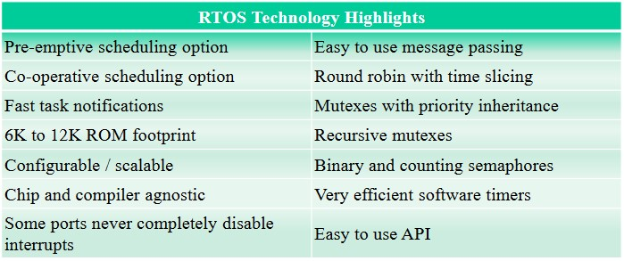

# Pregled področja

### Tipi senzorskih omrežij

- Omrežja, ki so vezana na infrastrkturo

- Ad-hoc omrežja

- Hibridna omrežja

###### Infrastrukturno podprta omrežja

- V tem primeru imamo infrastrukturo, ki podpira delovanje senzorskega omrežja

- Primeri omrežij:
  
  - BLE (Bluetooth low energy)
  
  - NB-IOT (nadgradnja LTE)
  
  - 5G
  
  - LoRa
  
  - SigFox ...

- Prednosti:
  
  - senzorski element se vedno priključi na jedro omrežja, ki nima omejitev z napajanjem ter posledično drugih omejitev
  
  - Jedro omrežja nadzira celotno komunikacijo v omrežju
  
  - Jedro omrežja skrbi za ustrezni časovni potek prometa (čakalne vrste)
  
  - Jedro omrežja skrbi za ustrezno komunikacijo pri mobilnosti senzorskega elementa
  
  - Komunikacija med elementi senzorskega omrežja vedno poteka preko jedra omrežja
  
  - Učinkovitejša komunikacija

- Slabosti:
  
  - Portebno je postaviti infrastrukturo, kar je lahko velik zalogaj pri velikih omrežjih
  
  - V primeru težav z infrastrukturo je ogrožena celota komunikacija v omrežju

###### Ad-hoc omrežja

- Ad-hoc omrežja niso vezana na infrastrukturo

- Prednosti:
  
  - Ne potrebujemo infrastrukture in posledično ni skupne administracije omrežja
  
  - Večja robustnost, ker ni odvisnosti od centralnega sistema
  
  - Administracija posameznega elementa ni potrebna
  
  - Omrežje se samo postavi in je takoj pripravljeno za uporabo
  
  - Hitra postavitev omrežja

- Slabosti:
  
  - Samoorganizacija je lahko zelo zahtevna
  
  - Omejen domet
  
  - Težave pri mobilnosti
  
  - Težave pri dostopu do medija
  
  - Težave pri usmerjanju / posredovanju paketov
  
  - Težave pri varnosti sporočil (težavno dodeljevanje in prekjlic certifikatov / ključev)

### Senzorska omrežja

- Senzorska omrežja so povezana z okoljem, za razliko od ostalih omrežij, kjer je uporabnik človek

- Možnosti upoorabe:
  
  - Pametne stavbe
  
  - Uporaba v izrednih razmerah (določanje širjenja požara, ...)
  
  - Varnostni sistemi (varovanje objektov, ...)
  
  - Industrija
  
  - Kmetijstvo
  
  - Medicina
  
  - Logistika
  
  - Nadzor prometa...

### Senzorski element

- Senzorski element lahko deluje kot:
  
  - **Izvor**: element za zajemanje fizikalnih veličin (na primer temperature)
  
  - **Ponor**: element lahko upravlja posamezne zunanje elemente (na primer ventil za zalivanje trave)
  
  - **Povezovalni element**: deluje kot prehod med senzorskim omrežjem in zunanjim svetom (na primer komunikacija s pametnim telefonom)

- Senzorski elementi so lahko popolnoma enaki (težave pri naslavljanju)ž

##### Način delovanja

- Senzorski element lahko izvaja različne funkcije:
  
  - Zaznava dogodka (na primer detekcija plinov)
  
  - Periodično merjenje (na primer temperatura)
  
  - Aproksimacijske funkcije (na primer funkcija naraščanja vode v reki)
  
  - Določanje roba (na primer pri širjenju požara)
  
  - Spremljanje gibanja (na primer živali v gozdu)

- Postavitev senzorskih elementov:
  
  - Naključno (na primer lahko jih "posejemo" po njivi)
  
  - Natančna postavitev (na primer v stavbah)
  
  - Senzorji se lahko premikajo (na primer žival v tropu)

##### Značilnosti elementa

- Senzorski elementi so običjano baterijsko napajani:
  
  - Omejen čas delovanja
  
  - Možnosti pridobivanja elergije iz okolice
  
  - Različne strategije pri varčevanju z energijo (posamezen element, omrežje kot celota, ...)
  
  - Posredovanje sporočil v senzorskem omrežju je energijsko potratno

- Običajno je težava z vzdrževanjem:
  
  - Senzorski element je lahko nedostopen (ni možnosti menjave baterije in popravila)
  
  - Cenovno popravilo ni smiselno

##### Izzivi

- Posebnosti senzorskih omrežij in izzivi:
  
  - Posredovanje stanja okolice in ne samo numerične vrednosti (omrežje lahko izvaja določene operacije)
  
  - Običajen postopek QoS ni smiseln, zato se uporabljajo druge metode
  
  - Zanesljivost omrežja
  
  - Robustnost omrežja
  
  - Čas delovanja omrežja
  
  - Povečanje števila elementov v omrežju
  
  - Pokrivanje velikih področij
  
  - Samodejno odpravljanje napak
  
  - Varnost omrežij

###### Pogosto uporabljene metode

- Samoorganizacija ormežja, saj zaradi velikega števila elementov ročna postavitev ni smiselna

- Komunikacija s posredovanjem sporočil (multi-hop network)
  
  - Izzivi: samoorganizacija omrežja, učinkovitost prenosa podatkov glede na porabljeno energijo,...

- Energijsko učinkovito delovanje (pogosto baterijsko napajanje)

- Medsebojno sodelovanje senzorskih elementov in delno procesiranje podatkov

- Senzorski elementi niso vedno naslavnjali glede na naslov. Pomembni so podatki, ne pa posamezen element (data centric network)

- Lokalnost (čim več akcij se izvede s sosednjimi elementi)

- Vedno se izvaja operacije s čim manjšo porabo energije. Podatki se na primer lahko zajemajo z manjšo natančnostjo

###### Tehnologije

- Tehnologija omogoča široko uporabo senzorskih omrežij
  
  - Miniaturizacija elementov
  
  - Nizka cena elementa
  
  - Povečanje procesorske moči, pomnilnika, učinkovitosti radijskega dela
  
  - Pridobivanje energije iz okolice

# FreeRTOS

- Izdelalo ga je podjetje Real Time Engineedr Ltd., ki ga ponuja v prosto uporabo brez omejitev, ki bi izvirale iz IP

- Dostopen je v izvorni kodi in se lahko prosto uporablja pod pogoji GNU.

- Optimiziran je za uporabo na šibkih mikrokrmilnikih

### Odlike



### Pomanjkljivosti

- Težko je zadovoljiti ostrim časovnim zahtevam

- Težko ga je nadgrajevati brez povečanja kompleksnosti

- Programer mora zagotoviti, da se bodo tudi procesi z nizko prioriteto izvajali

### Opravila

- FreeRTOS nima omejitev pri število opravil (taskov)

- Poenostavljen življenjski cikel: not running < = > running

##### Življenjski cikel opravil

- Opravilo je lahko v 4 različnih stanjih:
  
  - Running (se izvaja)
  
  - Ready (čaka na izvajanje)
  
  - Suspended (onemogočen)
  
  - Blocked (čaka na dogodek)

##### Razporejanje opravil

- Ob vsakem ciklu ure operacijski sistem določi, katero opravilo se bo izvajalo

- Ura se generira na strojnem nivoju in sproži prekinitev, ki omogoča operacijskemu sistemu menjavo opravil.

##### Prioritete opravil

- FreeRTOS omogoča prioritete opravil, pri čemer predstavlja 0 najnižjo prioriteto

- Število nivojev prioritet je določeno s konstanto **MAX_PRIORITIES**

- Najvičja prioriteta **MAX_PRIORITIES** -1

- Opravila z enako prioriteto se izvajajo po algoritmu *Round-robin*

- Potrebna je prazljivost, da opravila z višjo prioriteto ne zasedejo celotnega procesorskega časa

##### Ukazi za delo z opravili

- Task creation (vTaskCreate())

- destruction (vTaskDelete())

- priority management (uxTaskPriorityGet(), vTaskPrioritySet())

- delay/resume (vTaskDelay(), vTaskDelayUntil(), vTaskSuspend(), vTaskResume(), vTaskResumeFromISR())

### Čakalne vrste

- Čakalne vrste so osnovni mehanizem za komunikacijo med procesi

- S čakalnimi vrstami so izvedeni semaforji in mutexi

- Čakalne vrste delujejo na principu FIFO

- Uporabnik lahko določi velikost elementa in število elementov, ki jih lahko vrsta sprejme

- Element se lahko vstavi na konec ali začetek čakalne vrste

- xQueueHandle xQueueCreate(uxQueueLength-dolžina čakalne vrste, uxItemSize- velikost elementa čakalne vrste) - kreiranje čakalne vrste

- xQueueSend(xQueue, pvItemToQueue, xTicksToWait) - pošiljanje v čakalno vrsto

- xQueueReceive(xQueue, pvBuffer, xTicksToWait) - branje iz čakalne vrste

### Semaforji

- Semaforji so posebna oblika čakalne vrste, kjer:
  
  - je dolžina čakalne vrste samo en element
  
  - element vsebuje samo binarno vrednost

- Funkcije za delo s semaforji:
  
  - vSemaphoreCreateBinary
  
  - xSemaphoreTake
  
  - xSemaphoreGive

### Mutex

- Mutex je posebna oblika semaforja, ki se uporablja za sinhronizacijo dostopa do skupnih enot

- Funkcije za delo z mutex-i:
  
  - xSemaphoreCreateMutex
  
  - xSemaphorecreateMutexStatic
  
  - xSemaphoreCreateRecirsiveMutex
  
  - xSemaphoreCreateRecursiveMutexStatic
  
  - xSemaphoreGetMutexHolder

### Prekinitve

- V prekinitvenih funkcijah je potrebno uporabljati funkcije za delo z vrstami in semaforji, ki se končajo s končniico ISR

- Te funkcije so posebej prirejene za uporabo v prekinitvenih rutinah, ki lahko prekinejo tudi pisanje ali branje vrste v opravilih, ki so se izvajala pred prekinitvijo.

##### Delo s prekinitvami

- Prekinitveno rutino posatvimo s klicem funkcije:
  
  - void gpio_set_interrupt(**gpio_num** - številka nožice, ki proži prekinitev, **int_type** - vrsta fronte, ki proži prekinitev(prva, zadnja, obe), **handler** - ime funkcije, ki bo klicana ob prekinitvi)

# Strojna oprema elementa senzorskega omrežja

### Arhitektura elementa


### Mikrokontroler

Sodobni kinrokontrolerji vsebujejo:

- CPU

- delovni pomnilnik (RAM)

- FLASH pomnilnik

- EEPROM pomnilnik

- generator ure (clock)

- vmesnike za razna vodila (SPI, I2C, UART, ...)

- časovnike (npr. watchgod timer)

- primer: Atmel ATTINY816

### Vhodno-izhodne naprave

- Naprave za zajemanje podatkov iz okolice

- izhodne naprave

- običajno so na mikrokontroler povezane z enostavnimi vodili, kot na primer I2C ali SPI. Enostavne naprave imajo svoj protokol

- vhodno izhodne naprave lahko prožijo prekinitve glede na zunanje dogodke

### Komunikacijski elementi

- Komunikacijski elementi omogočajo komunikacijo z ostalimi napravami ter zunanjim svetom

- Običajno se komunikacija vrši preko radijskih valov

- običajno je prostor za anteno omejen, prav tako pa je omejena moč oddajnika

- Pogosto se za komunikacijo uporabljajo standardi: Bluetooth, ZigBee, WiFi

### Napajanje

- Napajanje je pogosto baterijsko, kar pomeni, da mora celoten element trošiti zelo malo električne energije

- V nekaterih primerih lahko energijo pridobivamo iz okolice. npr. sončne celice, mehanski pretvorniki, termo členi, ...

- Sodobni elementi imajo življenjsko dobo 10 let in več

### Serijska povezava

- Pogosto se uporabljajo izrazi RS232, UART, serijska linija

- Je star asinhroni protokol, ki se še vedno pogosto uporablja za priklop konzole

- V zadnjem času se uporabljata samo 2 signala (RX, TX) in opcijsko še signali (RTS, CTS)

- prenos se vrži serijsko (start bit, podatki, opcijsko pariteta, stop bit 1 ali 2)

- Običajno se uporabljajo hitrosti: 9600, 19200, 115200 baud

- Pri sodobnih računalnikih se uporablja pretvornik USB v serijsko povezavo

- Časovni potek prenosa (start bit, 8 podatkovnih bitov, brez paritete, stop bit):


- Baud je število prenesenih bitov na sekundo. Ločiti je potrebno med hitrostjo podatkovnih bitov na sekundo.

### Vodilo I2C

- Enostavno vodilo, ki deluje preko 2 povezav (SDA, SCL)

- vodilo vodi gospodar (master), na keterega priključimo več naprav (slave)

- Gospodar generira uro in  naprava, če je pozvana, odgovarja

- Časovni diagram:


- Podatek je prisoten nalin9iji, ko ej urin signal visok. Izjema sta začetek (S) in konec sporočila (P)

- Poenostavljen opis protokola:
  
  - start bit
  
  - prvih 7 bitov je naslov naprave, ki jo gospodar naslavlja
  
  - če je 8. bit po vrednosti 1, napravo bere, sicer pa na napravo piše
  
  - sledi bit ack (pošlje ga naslovljena naprava)
  
  - sledijo biti, ki jih gopodar piše oz. biti s katerimi naprava odgovarja
  
  - stop bit

- Zaradi enostavnosti  je vodilo pogosto relizirano programsko.

### Vodilo SPI

enostavno serijsko vodilo za povezavo naprav.

Vodilo vodi gospodar, na katerega lahko priklučimo več naprav.

Prenos se vrši serijsko, kjer gospodar tvori uro. V 8 urinih ciklih se prenesejo podatki preko shift registra. (8 bitov, vsak v svojem urnem ciklu)

Vsaka naprava se naslavlja posebaj.

Povezave gospodarja in naprave: 

- MOSI - master output slave input

- MISO - Master input slave output

Protokol je zelo hiter, uporablja se za komunikacijo komunikacijskih naprav.

Hitrost ure lahko doseže tudi do 10 MHz in več, spodnja hitrst ni določena

Realizacija je pogosto v strojni opremi, pri enostavnejših mikrokontrolerjih je lahko realizirana programsko.

Pogosto vezja podpirajo SPI in I2C vodila

SPI vodilo se uporablja tam, kjer so potrebne visoke hitrosti.

## Primer majhne porabe energije

###### Postopek delovanja

Mikroprocesor se aktivira vsakih 30 sekund:

- Zažene meritev na senzorju

- Prebere vrednosti temperature, vlage in zračnega tlaka

- Vsako deseto meritev izmeri vrednost baterije preko vgrajenega AD konverterja

- Pošlje vrednosti senzorja in baterije (enosmerna komunikacija)

- Vsako deseto meritev pošlje kalibracijske parametre senzorja

- Pošiljanje kalibracijskih vrednosti se izvede v času med dvema običajnima paketoma

- Vsi elementi so v času med dvema mertivama v načinu majhne porabe energije

###### Poraba

Povprečna poraba elementov pri meritvi: $17.104 \ mA$

Povprečna poraba elementov pri nekaitnosti: $9.1 \ \mu A$

Celotna povprečna poraba okrog $13.09 \ \mu A$

###### Poenostavitve pri računanju

- Ne upoštevajo se samopraznilni tokovi baterij, ki so med 1% in 3%

- Ne upošteva se pošiljanje paketov s kalibracijskimi podatki vsakih 5 minut

- Ne upošteva se merjenje napetosti baterije vsakih 5 minut

- Ne upošteva se večja poraba energije pri višjih napetostih (3V pri litijevih baterijah)

- Vsi podatki so pridobljeni iz priročnikov proizvajalcev

- Ne upoštevajo se parazitni tokovi, ki so posledica nečistoč

- Upoštevan je 50% izkoristek napetostnega pretvornika

###### Predviden čas delovanja

- Baterija AA s kapaciteto 2000mAh in izkopriskom napetostnega pretvornika 50% je 8.4 leta

- Litijeve batarije še dlje

# Senzorji

### Merilni instrument

V splošnem je merilni instrument naprava, ki pretvori fizikalno veličino, ki jo želimo meriti, v obliko, ki je primerna za odčitavanje


Fizikalna vrednost **X** se lahko meri neposredno ali posredno prek znane relacije

Signalna vrednost **S** ima značilnost, da jo lahko priredimo ali prenašamo. Običajno je v mehanski ali električlni obliki.

**M** je opazovana vrednost rezultata merjenja

###### Digitalno zajemanje vrednosti

Za digitalno zajemanje podatkov je potrebno dodati ojačevalec in A/D pretvornik

###### Analogno digitalna pretvorba

- Pretvorba analognega signala (običjano napetosti) v digitalno obliko

- Pomembni parametri:
  
  - resolucija
  
  - ptevilo bitov
  
  - čas pretvorbe
  
  - frekvenca vzorčenja
  
  - način pretvorbe

### Pasivni in aktivni senzorji

- Senzorji pretvarjajo fizikalno vrednost **X** v signalno vrednost **S**

- Pasivni senzorji ne dodajajo nergije, ampak jo kvečjemu odvzemajo iz merilenga okolja

- Aktivni senzorji dodajajo energijo v merilno okolje kot del merilnega procesa

### Značilnosti merjenja

###### Točnost in natančnost

Točnost je statična kakovostna meroslovna značilnica stopnja verodostojnosti, natančnost pa je stopnja ponovljivosti, kjer se pojavlja raztros vrednosti količin


###### Kalibracija

Kalibracija je relacija med fizikalno vrednostjo **X** in signalno vrednostjo **S** oz. pri digitalnem merjenju, digitalno vrednostjo.

###### Povečanje natančnosti

- Združevanje podatkov več senzorjev, ki merijo isto fizikalno vrednost

- Ocena vrednost: izračun povprečja, nizkopasovni filter, Kalmanov filter

###### Pregled enostavnih senzorjev

- Temperaturni senzorji:
  
  - Termistor: sprememba upornosti
  
  - Termočlen (thermocouple): spoj dveh različnih kovin, ki je izvor napetosti kot razlika temperatur med spojema

- Svetlobni senzorji: Fototranzistorji, Fotodiode, Fotoupor

- Senzor tlaka: piezoelektrični senzorji

- Senzor vlage: kapacitivni, uporovni

- Magnetomer: Hallova sonda: merjenje jakosti magnetnega polja

### MEMS

- Microelectromechanical systems - sistemi so mehanski sistemi izdelani na nivoju integriranega vezja

- Pogosto se uporabljajo za merjenje pospeška, v žiroskopih,...

- Zanje je značilna visoka robustnost in nizka cena

## Prenos podatkov iz senzorskih omrežij

### MQTT

Message Queueing Telemety Transport

Sporočillni sistem, ki ga je razvil IBM

Sedaj je standard ISO/IEC PRF 20922

Je sistem za pošiljanje sporočil na osnovi odjemalec/strežnik 

Prirejen za prenos sporočil med napravami (M2M)

Enostaven in primeren za rešitve z omejenimi resursi

##### Odjemalec strežnik

Odjemalec pošilja podatke na posrednika (broker), ki nato pošilja podatke strežnikom.

- Prostorska neodvisnost: napravi, ki si pošiljata podatke ne ptrebujeta informacij, kot so na primer IP številka in številka vrat

- Časovna neodvisnost: izvorna in ponorna naprava sta časovno popolnoma neodvisni

- Neodvisnost pri sinhronizaciji: prejemnik in oddajnik sta med seboj popolnoma neodvisna, saj za prenos skrbi posrednik.

##### Naslavljanje sporočil

Primer naslova: *Fakulteta/prostor/vir*

Naslov je hierarhičen, posamezni deli naslova so ločeni s /, simbol + pomeni kater koli del naslova(*fakuteta/+/temperatura*), simbol # pomeni karkoli (*fakulteta/#*), naslovi, ki se začnejo s \$ so rezervirani za sistem.

##### Vzpostavljanje povezave

MQTT uporablja TCP prenosni nivo.,

Odjemalec se mora povezati s posrednikom.

Connect -> ConAck

###### Kakovost storitve

MQTT omogoča 3 načine:

- Večinoma enkrat

- Vsaj enkrat

- Natančno enkrat.

###### MQTT v5.0

Pomembnejše posodobitve:

- Pri ponavljajočih sporočilih se lahko izpusti naslov. Prazen naslov pomeni naslov prejšnjega sporočila

- Definirana je žicljenjska doba sporočlila

- Sporoča se razlog prekinitve povezave

- Pri QoS 1 in 2 se javlja tudi tazlog v primeru napake

##### Varnost

- Varnost:
  
  - Za prijavo na strežnik se lahko uporablja uporabnišško ime in geslo
  
  - Uporablja se lahko šifrirana povezava TLS
  
  - Nekateri strežniki omogočajo lastno šifriranje podatkov E2E

- Težave:
  
  - Generiranje ključev s pomočjo certifikatov je procesorsko in pomnilniško zahtevno opravilo

##### Uporaba v brskalniku

MQTT omogoča komunikaciji preko tehnologije webSocket

Neposredna komunikacija je samo med posrednikom in brskalnikom

Posrednik je obilajno monejpi račinalnik, zato nima težav z resursi

Povezava je lahko šifrirana (https)

### CoAP

- Constrained Application Protocol

- Definiran je v priporočilu RFC 7252 (prvi dokument)

- Prirejen za prenos sporočil med napravami (M2M)

- Je podoben HTTP protokolu, z razliko, da je optimiziran za prenos majhne količine podatkov

- Odlike
  
  - Web protokol, ki ej prilagojen za M2M okolje    
  
  - Asinhrono prenašanje podatkov
  
  - Generira malo dodatnih podatkov in prometa
  
  - Enostaven za obdelavo na šibkih procesorjih
  
  - Omogoča naslavljanje preko URI naslova in vsebine
  
  - Omogoča začasno shranjevanje sporočil
  
  - Omogoča prehod na HTTP

###### CoAP nivoji

- Sporočila prenaša preko UDP protokola

- Sporočila prenaša asinhrono

- Deluje po načinu zahteva/odgovor

- Tipi sporočil:
  
  - S potrditvijo
  
  - Brez potrditve
  
  - Potrditev
  
  - Reset

###### CoAP šifriranje sporočil

- HTTP omogoča šifriranje preko TLS protokola

- CoAP omogoča šifriranje sporočil z uvedbo DTLS (Datagram TLS over UDP), ki deluje nad UDP in pod CoAP

# Fizični nivo

### Načini prenosa podatkov

- Najbolj pogosto uporablja elektromagnetno valovanje

- Svetloba

- Ultrazvok

### Dodelitev frekvence

Za oddajanje na posamezni frekvenci je potrebna licenca

- radioamaterji

- GSM, UMTS (licenco ima ponudnik storitve)

- TV, radio

Zelo ozek frekvenčni pas je namenjen za uporabo brez licence ISM (Industrial Scientific and Medical) področje:

- Omejena oddajna moč

- razlike med državami

### Širjenje EV

- Pri širjenju EV se pojavijo težave v obliki:
  
  - odbojev
  
  - lomljenja
  
  - raztrosov

### Brezžični prenosni kanal

- Moč signala podajamo v dBm (decibel na milivat)
  
  - $x = 10log_{10} \frac{P}{mW}$

- Manjšanje moči signala z oddaljenostjo pogojena s kvadratom razmerja oddaljenosti in valovne dolžine

- Spreminjanje moči signala (fading)
  
  - spreminjanje je lahko posledica različnih poti sprejetega signala
  
  - Hitre spremembe (fast fading)
  
  - počasne spremembe (slow fading)

- Motnje, ki so posledica drugih izvorov radijskega valovanja (interference)

- Dopplerjev zamik pri premikajočih se napravah

###### Prenos podatkov (omejitve)

- nyquistov teorem (maksimalna kapaciteta prenosnega kanala):
  
  $C = 2Blog_2L$ bit/sec

- Shannonov teorem:
  
  $C = Blog_2(1+(s/n)$ bit/sec

###### Modulacije

- Amplitudna

- Frekvenčna

- Fazna

### Sprejemanje signala

Pri sprejemanju signala želimo iz sprejetega signala dekodirati oddano vrednost.

Težave:

- Uskladitev sprejemnje in oddajne frekvence

- Sinhronizacija simbolov

- Sinhronizacija na nivoju paketov

- Motnje v sprejetem signalu

###### Motnje pri sprejemu

- Sprejeti signal je sestavljen iz oddajnega signala, šuma in interferenc (SINR - signal to noise ratio)
  
  $SINR = 10 log_{10}(\frac{P_{rec}}{N_0 + \Sigma_{i=1}^{k} I_i})$

- Ocena signala na sprejemniku je običajno sestavljena iz prejete moči in SINR

##### Simbol

- Simbol je najmanjši časovni interval, v katerem se prenaša bit, ali če to modulacija omogoča, več bitov

- **Detekcija simbola**:
  
  - Težava nastane pri določanju začetka simbola, oz. določanje ure
  
  - Težavo lahko rešimo z uporabo kodiranja, kot na primer Manchester

##### Določanje začetka okvirja

- Oddajanje se začne s sekvenco, ki ej potrebna za prilagoditev sprejemnika

- Iz zaporedja prejetih bitov je potrebno določiti začetek okvirja
  
  - Določimo ga lahko z uporabo posebne kode, ki se ne more pojaviti pri običajnem prenosu podatkov
  
  - Z uporabo kode, ki ej rezervirana za začetek paketa (npr. 0xAA). Takšna koda se ne sme pojaviti v podatkih!

- Na podobno težavo naletimo tudi pri običajnem serijskem prenosu, kot je na primer RS 232

# Dostop do medija

### Dostop do skupnega medija

Naprave za komunikacijo uporabljajo skupen medij. Ena naprava oddaja, vse ostale sprejemajo oddani signal.

Kot skupni medij smatramo skupno žično povezavo, uporabo istaga frekvenčnega pasu, itd.

Težava nastopi pri hkratnem oddajanju dveh ali več naprav.

V tem primeru sprejemnik ne more pravilno sprejeti podatkov in zato je prenos nepravilen.

##### Težave pri prenosu podatkov

- Oddajanje in sprejemanje je energetsko potratno

- Trki paketov

- Paket ni bil sprejet (preslišan)

- Poslušanje, čeprav ni nobenega oddajanja

- Kompleksen protokol, ki porablja druge resurse (cpu, pomnilnik)

###### Zagotavljanje ustreznega dostopa

- Kako zagotoviti, da ne prihaja do oddajanja več naprav hkrati (collision)?

- Kako čim prej zaznati oddajanje več naprav hkrati?

- Kako pri upoštevanju omenjenih zahtev zagotoviti čim boljše zmogljivosti prenosa podatkov (propustnost, čas dostopa, ...)?

### Načini dostopa

Skupinski dostop delimo na:

- Dostop brez trkov:
  
  - Naprave se dogovorijo o načinu dostopa (Token ring, ...)
  
  - Ena izmer naprav koordinira dostop do medija (GSM, ...)

- Dostop s trki
  
  - Reševanje trkov (Tree, Windows, ...)
  
  - Naključni dostop do medija (Aloha, Csma, ...)

##### Dostopi brez trkov - dogovor

Naprave se dogovorijo o načinu dostopa:

- Naprave delujejo po natančno določenem načinu, ki je  lahko določen vnaprej ali pa se določi ob inicializaciji oz. spremembi omrežja

- V tem primeru naprava oddaja samo v časovni rezini, ki ji je namenjena

- Eden od načinov je podajanje žetona. Naprava lahko odda paket, ko prejme žeton. Žeton nato posreduje naslednji napravi. V tem primeru mora svaka postaja poznati svojega soseda, da so v komunikacijo vključene vse naprave

- Takšna omrežja omogočajo dobro izrabo medija ter uvedbo prioritet. Slabosti so: dolg odzivni čas, rekonfiguracija omrežja pri vstopu ali izstopu naprave.

###### Dostopi brez trkov - koordinacija

Ena izmed naprav koordinira dostop do medija:

- V tem primeru je ena izmed postaj koordinator omrežja

- Ta postaja določa, katera postaja lahko oddaja v določenem trenutku in tako preprečuje oddajanje več postaj hkrati

- Takšen način omogoča zelo dobro izrabo medija, zato se uporablja v  mobilnih omrežjih (GSM, UMTS, LTE, ...)

- Slabost je v nesimetrični komunikaciji, saj je vedno ena naprava koordinator omrežja

- Težave se pojavijo pri vstopu novih naprav v omrežje

###### Dostop s trki

Reševanje konfliktov (primer Windows protokol):

- Naprave, ki so oddajale in pri tem zaznale trk, se razdelijo v dve skupini. Prva skupina bo v naslednjem koraku oddajala, druga skupina bo počakala, da se oddajanje zaključi. V drugo skupino spadajo tudi vse ostale naprave, ki niso oddajale

- Delitev na skupine poteka s pomočjo naključnega generatorja, kjer je predstavnik skupine izbran z vrjetnostjo 0.5

- Če pri oddajanju ponovno pride do trka, se postopek deljenja aktivne skupine ponovi

###### Naključen dostop

- Najbolj razširjen algoritem za naključni dostop je ALOHA protokol oz. njegove izpeljanke

- Aloha protokol je bil razvit 1970 na havajski univerzi

- Protokol oz. njegove izvedenke se uporabljajo praktično v vseh modernih komunikacijskih protokolih, kjer je potreben dostop do skupnega medija (WiFi, GSM, UMTS, LTE). Mobilni protokoli ga uporabljaljo pri vključevanju uporabnika.

- Obstajata 2 vrsti: običajni in predalčkasti (slotted Aloha).

## Aloha protokol

Primer delovanja:

- Naprava pošlje paket,

- v primer, da je prišlo do napake pri prenosu, naprava počaka naključen čas in postopek ponovi.

Koordinacije med napravami ni, potreben je mehanizem za zaznavanje napak.

Protokol je primeren za neobremenjena omrežja, kjer je vrjetnost napake majhna.

##### Predalčkasti Aloha protokol

- Pri predalčkastem Aloha protokolu so naprave med seboj časovno usklajene in lahko oddajajo samo v točno določenih intervalih (predalčkih)

- Pri trku se izračuna naključno število predalčkov, ki jih bo naprava preskočila

- Ker je točno določen čas oddajanja, se pri trku pokvarijo samo paketi tega predalčka, zato je propustnost večja

#### Propustnost

- Predpostavimo, da je vrjetnost generiranja k okvirov v intervalu t podana s Poissonovo vretnostno porazdelitvijo:
  
  $\pi_k(t) = {(\lambda t)^k \over k!}e^{-kt}; G = \lambda t$

- Vrjetnost n paketov v času 2t, kjer je t čas trajanja paketa:
  
  $P_n = \frac{(2G)^n}{n!}e^{-2G}$

- Vrjetnost pri n=0 pomeni, da ni bil poslan noben apket in ni prišlo do trka

- Delež pravilno prenesenih paketov je podan z enačbo:
  
  $S = GP_0 = Ge^{-2G}$

- Najrečji delež pravilno prenesenih paketov zaveznega Aloha protokola je pričližno $0.184$

- Pri predalčkastem Aloha protokolu se delež pravilno prenesenih paketov poveča na $0.368$

### Težave pri dostopu do skupnega medija

- Pri dostopu do skupnega medija naetimo na težavo, kako zaznati ter se izogniti trkom na mediju

- Zaznava trka mora zahtevati im manj časa

- Ko trk zaznamo, je potrebno v čim krajšem času nadaljevati z uspešnim prenosom podatkov.

- Najbolje je, da na isti frekvenci ne sprejemamo in oddajamo hkrati, ko oddajamo ne moremo spremejati.

##### Poslušanje pred oddajo

**CSMA** Carrier sense multiple access preverja ali je medij prost pred oddajo.

Težave lahko nastanejo zaradi skritih vozlišč:

- Če se A in C ne vidita, oba pa vidi B, lahko pride do trkov.

##### Obveščanje o oddajniku

- Težava radijskega prenosa je, da je sprejet signal bistveno šibkejši od oddanjega signala, zato naprava med oddajanjem ne more zaznati, če oddaja še kakšna druga naprava.

- Možne reštve:
  
  - Poseben kanal, kjer se sporoča zasedenost kanala (Busy tone)
  
  - Naprava sporoči ostalim naprava, da bo oddajala. Zahtevo po zasedenosti kanala morata sporočiti tako oddajna, kot sprejemna naprava - RTS (Request to send), CTS (Clear to send)

### Algoritem S-MAC

- S-MAC - Sensor MAC

- Težava je neprestano poslušanje medija

- Algoritem uvaja periodo aktivnosti in periodo spanja

- V aktivni periodi se naprava sinhronizira na sosede, če sosedov ni, izbere svojo periodo

- Pojavijo se lahko otoki z različnimmi cikli:
  
  - V tem primeru lahko ena izmed naprav deluje kot posrednik (S-MAC)

### Algoritem Timeout-MAC

- Naprava lahko spi, ko druga naprava oddaja

- Čas trajanja spanja se določi z NAV vektorjem

- Možna težava pri komunikaciji: C žali poslati napravi D, vendar A že pošilja napravi B.

### Brez sinhronizacije

- Naprava se periodično zbuja in preverja ali je signal prost

- Če zazna signal, ki je večji od povprečnega šuma, predpostavi, da je kanal zaseden in oddajanje v teku. Pred podatki mora biti dovolj dolg signal (preamble).

### PAMAS - dodatni kanal

- Kombinacija RTC/CTS in posebnega kanala za prenos podatkov

- Dodano je oddajanje posebnega signala s strani prejemnika

# Protokoli

### Protokol vezja NRF24L01+

- Integrirano vezje proivajalca Nordic, ki se uporablja na vajah

- Značilnosti:
  
  - Bitna hitrost 250 kbps, 1Mbps, 2Mbps
  
  - Modulacija GFSK
  
  - Spremenljiva dolžina podatkov v paketu (0-32 zlogov)
  
  - Lahko deluje v načinu avtomatskega potrjevanja in ponovnega ošiljanja paketov
  
  - Deluje na področju ISM 2.4 GHz
  
  - 126 kanalov

- Nima možnosti broadcasta, nima možnosti sprejemanja vseh paketov.

###### Oblika paketa

- Preamble: sekvenca, ki ej potrebna za sinhronizacijo sprejemnika

- Address: naslov prejemnika

- Packet Control Field: kontroli del paketa

- Payload: podatki, ki se prenašajo

- CRC: ciklična redundančna koda

- Kontrolni del paketa:
  
  - Payload length: dolžina podatkov
  
  - PID (Packed Identification): označuje ponovno pošiljanje paketa
  
  - NO_ACK: v primeru avtomatskega potrjevanja pošiljatelj za ta paket ne zahteva potrditve

###### Več prejemnikov

- Naprava lahko komunicira s 6 prejemniki

- Pri takšnem načinu je za vse prejemnike:
  
  - isti frekvenčni kanal
  
  - enaka dolžina naslova prejemnika
  
  - enaka oddajna moč
  
  - enaka bitna hitrost
  
  - enak način izračuna CRC

- V primeru uporabe več prejemnikov je naslavljanje omejeno

## IEEE 802.15.4

- Standard opredeljen leta 2003

- Odlike:
  
  - zelo nizka cena
  
  - enostavna imlementacija
  
  - zanesljiv prenos podatkov
  
  - prenos podatkov na kratke razdalje
  
  - majhna poraba energije

- Značilnosti:
  
  - omogoča hitrosti 250kb/s, 50kb/s, 20 kb/s
  
  - Omogoča komunikacijo v obliki zvezde ali točka-točka
  
  - CSMA-CA dostop do kanala
  
  - dinamično naslavljanje
  
  - majhna poraba energije
  
  - podpira veliko število naprav (64K)
  
  - lahko uporablja frekvenčne pasove:
    
    - 16 kanalov na 2,4 GHz
    
    - 10 kanalov na 915 MHz
    
    - 1 kanal na 868 MHz

- ZigBee uporablja IEEE 802.15.4

#### Arhitektura

Standard IEEE opredeljuje sapodnja dva sloja:

- Fizični nivo:
  
  - Fizični nivo omogoča komunikacijo na treh ISM področjih

- Moduacije:
  
  - področje 2,4 GHz:
    
    - 250kb/s
    
    - 16 simbolov tvori ortagonalno množico 32-chipnih(bitnih) PN kod:
      
      - Zaporedje 32 bitov, takih zaporedij je 16 -> 4 biti na simbol
    
    - Čipna modulacija je O-QPSK na 2 Mchip/s
  
  - Področje 868/915 MHz PHY
    
    - 20/440kb/s
    
    - Podatkovna podulacija je BPSK z diferencialnim kodiranjem
    
    - Spreading code is a 15-chip m-sequence
    
    - Čipna modulacija je BPSK na 300/600 chip/s

- Odddajna moč
  
  - Minimalno vsaj 0,5 mW
  
  - Občutljivost sprejemnika (PER < 1%)
    
    - -85dBm na 2,4 GHz
    
    - -92dBm na 868/915 MHz
  
  - Omogoča:
    
    - merjenje razmerja signal šum (RSSI)
    
    - merjenje moči signala
    
    - indikacijo praznega kanala
    
    - dinamično izbiro kanala

- Oblika okvirja:
  
  - Preamble (32 zlogov): sinhronizacija sprejemnika
  
  - Start of packet delimiter: znak za začetek paketa (8 bitov)
  
  - PHY header: glava paketa (8 bitov), ki vsebuje tudi dolžino podatkov
  
  - PSDU: podatki dolžine 0 do 127 zlogov

#### Pregled značilnosti MAC plasti

- Uporablja 64 bitni IEEE ali kratni 16 bitni naslov

- Naprava je lahko v vlogi:
  
  - Koordinatorja omrežja (network coordinator)
  
  - polno funkcionalna naprava (Full Function Device - FFD)
    
    - podpira vse topologije
    
    - ima zmožnost koordiniranja omrežja
    
    - lahko komunicira s poljubno napravo
  
  - naprava z omejeno funkcionalnostjo (Reduced function Device - RFD)
    
    - podpira samo topologijo zvezde
    
    - lahko komunicira samo s koordinatorjem omrežja
    
    - zalo enostavna implementacija

- Enostavna oblika okvirja

- Priključitev in izključitev iz omrežja

- Šifriranje podatkov (AES 128 bit)

- Opcijski "superframe" in zagotovitev časa v okvirju

#### Načini naslavljanja

- Vse naprave imajo enoličen 64 bitni naslov (IEEE)

- Napravi se lahko dodeli krajši 16 bitni naslov

- Načini naslavnljanja:
  
  - Omrežje + naslov naprave v omrežju zvezde
  
  - Naslov izvora/ponora v primeru komunikacije točka-točka

#### Podatkovni okvir

- Omogoča prenos do 104 zlogov podatkov

- Vsebuje zaporedno številko, kar omogoča pravilno zaporedje

- Robustna struktura omogoča sprejem v slabih razmerah

- Preverjanje pravilnosti prenosa s FCS (Frame check sequence)

#### Kontrolni okvir

- Kontrolni okvirji se uporabljajo za kontrolo in konfiguracijo elementov omrežja

#### Super okvir

- Sestavljajo ga 4 periode:
  
  - Beacon
  
  - podaljšana perioda Beacon
  
  - CAP - tekmovalen dostop do kanala
  
  - CFP - dostop do kanala je dodeljen posamezni napravi

#### Tipični promet

Standard predvideva tri tipične primere prometa:

- periodični promet, kot na primer podatki iz senzorjev

- Naključni promet, kot na primer prižiganje in ugašanje luči

- Ponavljajoč promet z majhno zakasnitvijo, kot na primer računalniška miška

## Bluetooth

Standard so postavila podjetja Ericsson, nokia, IBM, Intel in Toshiba, osnovan leta 1998

Proizvajalci so združeni v Bluetooth SIG (Special Interest Group)

Preko 30000 podjetij uporablja Bluetooth, Vsako leto več kot 8.2 miljard novih naprav.

#### Namen

- Osnovana različica je bila načrtovana za prenos podatkov in zvoka na kratke razdalje (osebno omrežje)

- namen je nadomestitev kablov na kratkih razdaljah

- Novejše različice podpirajo tudi povezovanje naprav z majhno porabo energije na IoT

#### Različice

BT lahko razdelimo na 2 skupini:

- Naprave do različice 3, ki so namenjene prenosu govora in podatkov. Te različice se označujejo tudi z BR/EDR
  
  - BR (Basic Rate) - osnovna hitrost prenosa podatkov do 721 Kbps
  
  - EBR (Enhanced Data Rate) - povečana hitrost do 2.1 Mbps

- naprave od različice 4.0 naprej spadajo v kategorijo LE (Low Energy), ki imajo manjšo kompleksnost od predhodnikov in so optimizirane za manjšo porabo energije

#### Naprave

Standard omogoča tri vrste naprav:

- Naprave, ki omogočajo samo BR/EBR funkcionalnosti (BR/EBR devices)

- Naprave, ki omogočajo samo LE (LE only devices / single mode LE devices)

- BR/EBD/LE (Dual mode devices)

#### Poenostavitve / izboljšave

Poenostavitve LE v primerjavi z BR/EBR:

-  Lahko je implementiran samo oddajnik, samo sprejemnik ali oba,

- Ne podpira prenosa zvoka

- Ne podpira omrežja scatternet

- Ne zahteva neprestanega klicanja naprave (pooling)

- Ne podpira sniff in park načinov delovanja

Posledica teh poenostavitev je enostavnejši avtomat stanj.

Zmanjšanje zahteve po pomnilniku (ROM/RAM):

- Krajši paketi

- Krajše glave paketov

- Enostavnešji protokol

- Enaka oblika paketov

Optimizirana poraba električne energije:

- Samo pošiljanje podatkov

- Samo sprejemanje podatkov

- Dvosmerna komunikacija

#### Fizični nivo

- Deluje na 2,4GHz ISM področju

- Frekvenčno področje je razdeljeno na 40 kanalov
  
  - 37 podatkovnih kanalov
  
  - 3 kanali za iskanje sosednih naprav

- Deluje na način preskakovanja frekvenc (frequency hopping)
  
  $f_{n+1} = (f_n + hopIncrement) mod 37$

- GFSK (Gaussian Frequency Shift keying) način podulacije

- Moč oddajnika v razponu od 0.01mW (-20 dBm) do 10mW (+10dBm)

- Načrtovani dosegi med 30 in 100m

#### Povezovalna plast

Naloga povezovalne plasti je:

- Vzpostavitev povezave

- nadzor povezave

- izbira frekvenčnega kanala

- podpora topologijam za prenos podatkov

#### Avtomat stanj

Poenostavljen avtomat stanj na povezovalni plasti:


#### Naslov naprave

Naprava ima lahko javni naslov, naključni naslov ali oba:

- Jasvni naslov je enoličen 48.bitni naslov
  
  - 24 bitov določi IEEE - id proizvajalca
  
  - 24 bitov določi proizvajalec

- Naključni naslov se uporablja za skrivanje naprav pred odkrivanjem identitete:
  
  - Statični naslov, kise ne spreminja po vklopu naprave
  
  - Privatni naslov, ki se lahko spreminja med delovanjem

#### Iskanje naprave

- Naprava mora pošiljati pakete za oznanjanje (advertising packets) na kanalih, za oznanjanje (37, 38 in 39)

- Naprava, ki išče (scanner) posluša enega izmed kanalov in na prejeti paket odgovori

#### Prenašanje podatkov

- Gospodar pozove podrejeno napravo, ki odgovori. Na isti frekvenci se lahko pošljejo do štirje paketi

- Med menjavo frekvenc je prekinitev (connection interval), ki je lahko med 7.5ms in 4s

#### Oblika paketa

- BLE uporablja enosnto obliko paketa
  
  - Preamble (8 bitov), Access Address(4 biti), PDU (2 do 39 bitov), CRC (3 biti)

- V nadaljevanju se glede na PDU del paketa loči na:
  
  - Oznanjevalni paket (Advertising channel PDU)
  
  - Podatkovni paket (Data Channel PDU)

#### Splošni vmesnik HCI

Med povezovalno plastjo in višjimi plastmi je univerzalni vmesnik HCI (Host Controller Interface)

Namen standardnega vmesnika je ločitev strojnega in programskega dela implementacije LE.

Univerzalni vmesnik je enak kot v nižjih različicah (BR/EBR)

Večina samostojnih implementacij standarda LE je izvedena v enem integriranem vezju (SoC).

#### Plast L2CAP

Bluetooth deluje na principu kanalov, ki so označeni z CID (Channel Identifiers). Plast L2CAP skrbi za pravilno dostavo paketov, ki pripadajo kanalom.

Večje bloke podatkov višjih plasti razdeli na manjše bloke, ki ustrezajo fizičnemu nivoju (Fragmentation / Defragmentation).

Multipleksiranje in demultipleksiranje podatkov različnih kanalov preko skupnega logičnega podatkovnega kanala (LE-U).

Upravlja s signalizacijo.

Plast L2CAP(Logical Link Control and Adaptation Protocol) posreduje pakete višjim slojem.

#### Varnostni mehanizmi

- Varnostne mehanizme upravlja Security Manager (SM)

- Sm je zadolžen za:
  
  - Delo s kriptografskimi ključi (generiranje, shranjevanje)
  
  - delo z naključnimi naslovi naprave (skrivanje iddentitete)

- Kriptografski ključi so lahko dolgi med 56 in 128 biti s korakom 8 bitov.

- Naloge dela z varnostnimi mehanizmi so prepuščene gospodarju omrežja.

###### Izmenjava gesel

- BLE omogoča tri načine izmenjave gesel:
  
  - Passkey entry - izmenjava gesel preko uporabniškega vmesnika
  
  - Just Works - v primeru, ko vsaj ena naprava ne omogoča izmenjave gesel preko uporabniškega vmesnika
  
  - Out of bound - izmenjava gesel preko drugih načinov komunikacije npr. NFC

- Trije načini komunikacije:
  
  - prejverjena MITM (man in the middle) zaščita
  
  - Brez MITM zaščite
  
  - Brez šifriranja

#### Protokol ATT

Atribut je opisan s tremi značilnostmi:

- Attribute type - kaj atribut opisuje. iz tega je tudi razvidna dolžina podatkov

- Attribute Handle - enolična številka ateibuta med 0x0000 in 0xffff

- Attribute Permissions - pravize za dostop do atributa (branje, pisanje, branje in pisanje). Poleg tega lahko zahteva še preverjanje pristnosti in avtorizacijo.

Atribut je lahko fiksne ali spremenljive dolžine.

Različni načini dostopa do atributov:

- Zahteva/odgovor

- ukaz/obvestilo

- naznanitev/potrditev

#### Splošni profil GATT

Splošči profil GATT (Generic Attribute Profile) uvaja hierarhijo med atribute

Hierarhijo sestavljajo:

- Profili
  
  - Servisi
    
    - Karakteristike

Profili združujejo več servisov. Names servisov je razbiti podatke na logične enote, ki združujejo podatke, ki jih imenujemo karakteristike.

Servisi se razlikujejo bo identifikatorju UUID (Universally Unique identifier), ki je 128 bitni. Za hitrejše delovanje se le ta prevede v 16 bitni naslov.

#### Profil GAP

Profil, ki omogoča splošni dostop se imenuje Generic Access Profile (GAP).

To je profil, ki ga mora imeti vsaka naprava in obsega:

- iskanje naprav

- priključevanje naprave

- varnost

GAP definira naslednje tipe:

- Broadcaster - naprava samo oddaja

- Observer - naprava samo sprejema in ne vsebuje oddajnika

- Peripheral - naprava sprejme povezavo in se obnaša kot suženj v Piconetu. Ima samo eno aktivno povezavo

- Central - naprava, ki začne povezavo. naprava lahko ima več podrejenih naprav.

#### Profili, ki slonijo na GATT

- GATT profil omogoča preko servisov dostop do karakteristik, to je do podatkov

- Profili, ki slonijo na GATT, to je GATT-based profiles, določajo tisti del profila, ki ej vezan na napravo, npr. zajem vrednosti baterije.

- Postavljenih je že veliko standardnih profilov, ki definirajo posamezne fonkcionalnosti. Tak primer je spremnjanje EKG signalov. Standardni profili so zanimivi predvsem zaradi enakega dostopa do istih funkcionalnosti na različnih napravah.

#### Različica v4.1

V primerjavi z v4.0, v4.1 prinaša celo vrsto izboljšav v delovanju. Nekatere najbolj vidne so:

- Omogoča uporabo 32-bitnih UUID naslovov

- omogoča napravi, ki ima BR/EBR in LE vmesnik, da deluje kot ponavljalnik (HUB)

- zmanjšana poraba energije

#### Različica v4.2

Prinaša posebnosti:

- odprava pomanjkljivosti starejših različic

- povečana dolžina LE paketa na fizičnem nivoju

- hitrost prenosa je povečana za faktor 2.6

- izboljšana varnost

- posebni kanali na L2CAP nivoju, ki omogočajo bodočo uporabo IPv6

#### Različica v5.0

Prinaša:

- povečan doseg do 40m v prostorih

- hitrost se je povečala s faktorjem 4.6 v primerjavi z različico 4.0

- večja oddajna moč

- manjša poraba energije

- primeren za uporabo v IoT

- Dva nova načina prenosa podatkov na fizičnem nivoju:
  
  - LE 2M (hitrost prenosa 2Mbit/s)
  
  - LE Coded (Hitrost prenosa 500Kbit/s ali 125 Kbit/s)

### Različica v5.1

Prinaša:

- Določanje položaja v prostoru na osnovi kota prejetega / oddanega signala

- Shranjevanje podatkov o GATT

- Izboljšave načina oglaševanja naprave

- Izboljšave protokola

- Izboljšava QoS

###### Določanje kota na dva načina

- Kot prejetega signala AoA (Angle of arrival)

- Kot oddanega signala AoD (Angle of Departure)

- Za določanje kota je potrebno več anten

###### Shranjevanje podatkov

- Podatki se pri napravah zelo redko spreminjajo

- S shranjevanjem pridobljenih atributov (GATT) o napravi le teh ni potrebno pridobivati pri ponovni vzpostavitvi povezave

###### Oglaševanje naprave

- Oglaševalski paketi se ne oglašujejo v zaporedju, temveč se lahko oglašujejo na naključno izbranem zaporedju kanalov.

###### Sinhronizacija

- Sinhronizacija je lahko časovno in energijsko zahtevno opravilo, še posebej za naprave z omejenimi resursi

- Protokol omogoča, da naprava z omejenimi resursi prejme informacijo o sinhronizaciji od napravi, ki ni tako omejena

###### Nekaj manjših izboljšav

- Podpora modula HCI za testiranje zaščitenih povezav (kriptografski ključi za debagiranje)

- Izboljšano informiranje glede natančnosti ure, ki se uporablja pri nizki porabi energije (spanje)

- Dodana informacija o oglaševalcu v Scan Response Paketu

- Natančno pojasnjena vloga QoS

## Bluetooth mesh

- Omrežje omgoča povezavo velikega števila naprav z veliko napravami (many-to-many, m:m)

- Omrežje je standardizirano

- Deluje nad BLE skladom (od 4.0 naprej)

- Omogoča varno povezavo (šifriranje)

- Omogoča do 32767 naprav, naprave, ki so baterijsko napajane, še vedno lahko delujejo v režimu majhne porabe energije

- Za komunikacijo uporablja samo pakete za obveščanje(advertising packets)

- V napravi je lahko več elementv, kjer se lahko vsak element samostojno naslovi

###### Sklad

- Models: Skupek osnovnih funbkcionalnosti elementa

- Foundation Models: osnovne funkcionalnosti elementa (npr. nastavitve elementa)

- Access Layer: skrbi, da so podatki pravilno posredovani višjim plastem

- Upper transport layer: Definira šifriranje paketov na storitveni plasti. Upravlja elemente z majhno porab energije (Friendship)

- Lower Transport Layer: Zagotavlja zanesljiv prenos paketo Po potrebi pakete pretvori v serijo manjših paketov, ki se na drugi strani združijo

- Network layer: Mrežni nivo, ki določa naslavljanje in moreitno porepošiljanje paketa. Upravlja tudi s šifriranjem povezave.

- Barer layer: Prenosni nivo, ki določa kako se bodo paketi prenašali preko omrežja

###### Primer omrežja

Naprave v omrežju lahko imajo različne naloge:

- Posredovanje (Node relay)

- Majha poraba energije (Low energy)

- Prijateljska naprava (Friend node)

- Zastopnik (Proxy node)

###### Nadzovorano polavljanje

Paketi se v omrežju pšiljajo z nadzorovanim poplavljanjem:

- Pakete posredujejo nprej samo naprave, ki imajo funkcionalnost releja

- Ko naprava prejme paket, preveri v tabeli prejetih paketov, ali ej prejet paket predhodno sprejet. Naprej posreduje le eno kopijo paketa.

- Vsak paket ima števec korakov TTL (Time to live), ki se pri vsakem koraku zmanjšpa za ena. Ko je vrednost 0 se paket zavrže.

###### Grupe

V omrežju se postavijo grupe z enakimi značilnostimi, ki delujejo na načinu naročanja in objavljanja

###### Dodajanje naprave v omrežje

- Vsaka naprava se mora pred uporabo dodati v omrežje (Provisioning) npr. dodamo novo sijalko

- Naprava, kis e želi dodati v omrežje začne oddajati pakete za oznanjanje (*beacon*)

- V fazi dodajanja v omrežje se namestijo kriprografski ključi

- Preveri se pristnost naprave, ki se prijavlja v omrežje

- Problem je, ker je za dodajanje potrebna 2 nivoja kriptografije -> na nivoju grupe

### ANT+

- Protokol ANT+ je protokol, katerega lastnik je podjetje Garmin

- Uporablja se za povezavo senzorjev za upoprabo predvsem na področju športa

- Na trgu je veliko senzorskih elementov na področju športa

- Podpirajo ga nekateri mobilni teefoni

- Omogoča prenos podatkov na kratke razalje pri majhni podabi elektrine energije

- Deluje na področju ISM 2,4GHz

# Prenosni nivo

Osnovne naloge prenosnega nivoja:

- Uokvirjenje

- Odprivanje in popravljanje napak

- Nadzor prenosa paketov

- Upravljanje s prenosnim nivojem

Uokvirjenje:

##### Uokvirjenje

- Sync in SFD polje sta potrebna za sinhropnizacijo in določitve začetka PLCP glave

- PLCP glava vsebuje informacijo o hitrosti prenosa, informacijo o tipu servise, dolžino paketov, ki se prenašajo (PSDU) in kodo za preverjanje pravilnosti prenosa podatkov CRC

###### Preverjanje pravilnosti

- pri enostavnih protokolih se uporablja kontrolna vsota

- Običjano se uporablja ciklina redundančna koda CRC

- CRC se lahko enostavno implementira v strojni opremi

- Še vedno obstaja mahhna vrjetnost, da bo pri večkratnih napakah CRC pravilno izračunan

### ARQ Protokol

- ARQ (Automatic Repeat reQuest) protokol je protokol s potrjevanjem. Če pride do napake, se pošiljanje ponovi.

- Obstajajo trije osnovni tipi ARQ protokola:
  
  - Alternating bit: menjava bita pri vsakem paketu
  
  - Goback N: pošiljanje več paketov in potrdi se v zaporedju zadnji pravilno sprejet paket
  
  - Selective Repeat/reject: Sekeltivno potrjevanje. Pošilja se samo manjkajoče pakete.

### Tehnike popravljanja napak

FEC (Forward error correcting):

- Bločno kodiranje

- konvolucijsko kodiranje

- hibridno kodiranje

##### Bločno kodiranje

- Vhodni blok k simbolov s P nivoji na simbol

- Izhodni blok n simbolo s q nivoji na simbol

- Običajno p=q=2

- Popravimo lahko t bitov, če velja
  
  $2^{n-k} \geq \Sigma_{i=0}^t (c(n,i))$, kjer c kombinacija.

- Primeri:
  
  - Repetition codes
  
  - Hamming codes, Reed-solomon codes
  
  - BCH codes, Golway codes, ...

- Popularen je Hamming (7,4), ki ima 4 vhodne bite. Popravi lahko napako na enem bitu. Zazna lahko napako na enem in dveh bitih.

- Z večanjem bitov postane kodno razmerje boljše a se veča tudi poraba energije procesorja, poveča se tudi zanesljivost in zmožnost popravljanja napak.

###### Prepletanje

- Napake se prikomunikacijah pogosto pojavijo skupaj (burst)

- Težavo se reši s prepletanjem (interleaving), kar pomeni, da se bloki ne pošiljajo zaporedno, ampak po delčkih. Del prvega bloka, del drugega bloka, ...

- Prepletanje ni popravljanje ali detekcija napak, ampak izogibanje napakam.

#### Konvolucijsko kodiranje

Uporaba zaporednih XOR operatorjev in združevanja le teh.

Primer: 1/2 konvolucijski kodirnik:

- $p_0[n] = 1 * x[n]+1 * x[n-1]+1 * x[n-2]$

- $p_1[n] = 1 * x[n]+0 * x[n-1]+1 * x[n-2]$

- Vhodno zaporedje 011100

- Izhodno zaporedje 00 11 091 10 01 11

Poraba energije z uporabo rezličnih kodnih razmerij, če večamo manjšamo porabo bo potrebovala več energije, a še vedno manj kot nekodirano za visoko zanesljivost.

#### Turbo kodiranje

- Algoritem *Turbo code* se približa Shannnovi teoretčni meji.

- Kot konvolucija, le da se gleda po 2h grafih in se ta grafa med sabo dopolnjujeta - popravljata

- Uporaba tudi v novejših sistemih, UMTS

- Naslednik je LDPC (low density parity check)

- LDPC se med drugim uporablja. 802.11 n/ac, 10GBase-T Ethernet

- LDPC:
  
  - XOR med vektorjem in matriko
  
  - Zelo učinkovit za velika kodna razmerja

### Hibridni modeli

- Hibridni model združuje ARQ in FEC

- pri ARQ se v primeru ponovitve portebna energija podvoji

- V primeru FEC pa je porabljena energija na prenesen bit večja, vendar je tudi večja vrjetnost pravilnega prejema paketa v primeru napak

##### Prilagajanje prenosnemu kanalu

Naprava se lahko prilagaja, glede na število napak oz. na razmerj signal šum:

- zmanjša kodno razmerje pri FEC

- zmanjša bino hitrost paketa

- zmanjša bitno hitrost

- poveča moč oddajanja

### Adaptivni modeli

Pridobivanje informacij o prenosnem kanalu:

- število ponovitev pri ARQ

- število popravljenih bitov pri FEC

- merjenje RSSI in razmerja signal šum

# Poimenovanje in naslavljanje

- Kako ločiti naprave in omrežja med seboj

- Poimenovanje je označenavnje stvari s ciljem enoličnega dostopanja do resursov (naprava, podatek, omrežje, ...)

- Naslov določa, kako dostopamo do resursa

- Težave nastanejo pri samodejnem določanju enoločnih imen in tudi naslovov

### Primeri naslovov pri RK:

- UID enolični naslov

- MAX naslov

- Omrežni naslov je naslov ki je bičajno povezan z usmerjanjem

- Oznaka omrežja služi za ločevanje omrežij med seboj

- Oznaka resursa (resourse identifier) je običajno enoločna oznaka (Web naslov)

### Delo z naslovi

- Poimenovanje (Address allocation): dodeljevanje imena iz nabora imen

- Odvzemanje imen (Adress dealocation)

- Detekcija in reševanje konfliktov (coflict detection/resolution)

- Povezovanje naslovov na rezličnih plasteh

- Format naslova

### Enoličnost naslovov

Naslovi so lahko:

- Globalno enolični (UUID, ...)

- Enolični v omrežju (lokalni IP naslovi)

- Lokalno enolični (Bluetooth naslovi v piconetu)

### Določanje naslovov

- Naprava ima lahko fiksno določen naslov - npr. MAC
  
  - Centralizirano določanje naslovov
  
  - Porazdeljeno določanje naslovov

- Napravi se lahko naslov določi dinamično - npr. DHCP

Iskanje podvojenih naslovov (DAD - Duplicate Address Detection)

- Strong DAD

- Weak DAD

### Režija pri naslavljanju

Pri določanju naslovov je težava pri izbiri dolžine naslova:

- Enoličen naslov
  
  - MAC: običajno 48 bitov
  
  - UUID: 128 bitov
  
  - IPv4: 48 bitov
  
  - IPv6: 128 bitov

### Primeri algoritmov

Nekaj primerov algoritmov za dodajanje naslovov:

1. Naključno izbere naslov iz nabora naslovov

2. izogibanje naslovov iz neposredne okolice

3. Začasno izbere poseben naslov za iskanje konfliktov:
   
   - Pošlje naključno izbrani naslov z uporabo posebnega naslova
   
   - Počaka na orgovor omrežja in v primeru podvojenega naslova postopek ponovi

4. Postopek, podoben postopku 3, s to razliko, da uporabi soseda, ki že ima dodeljen naslov.

###### Naključno dodajanje naslovov

Birthday paradox - zelo vrjetno je, da bodo naslovi podvojeni

#### Naslavljanje glede na vsebino

- V primeru naslavljanja glede na vsebino, rezultat vrnejo samo naprave, ki ustrezajo pogoju naslavljanja

- Primer sestavljenega naslova:
  
  - Temperatura je večja od 10 stopinj
  
  - Izbrani prostor so predavalnice
  
  - Relativna vlaga je manjša od 50 %

- V klasičnih omrežjih se naslavljanje glede na vsebino postavi nad IP naslovom

#### Geografsko naslavljanje

- V primeru geografskega naslavljanja naslov določa:
  
  - Fizična lokacija naprave
  
  - Področje, v katerem se nahaja naprava

- Pri geografskem naslavaljanu se uporablja poseben primer geografskega usmerjanja prometa

# Čas v senzorskih omrežjih

Čas je v senzorskim omrežjih potreben za:

- Sinhronizacijo naprav

- Določanje vrstnega reda dogodkov v omrežju

- Izračun veličin, ki so osvisne od časa

- Podporo protokolom na MAC nivoju (TDMA)

- ...

Vrste časov:

- Fizični čas, to je čas, ki je poseldica fizikalnega procesa (npr. določitev trajanja 1 sekunde v senzorju)

- realni čas, to je referenčni čas (UTC - coordinated universal time)

- Logični čas, ki ga uporabljamo za določanje zaporedja dogodkov

Primer določitve logičnega časa je algoritem Lamport

Primer določanja kota:

- Če določamo vpadi kot zvoka, upoštevamo časovno razliko med dvemi senzorji ter razdaljo med njima dvema in tako izračunamo kot

### Ura v senzorskem elementu

ura je v senzorskem elementu sestavljena iz:

- oscilatorja

- števca

Težava oscilatorjev je natančnost

- Izvor napake je lahko: sprememba temperature, napetosti, vlage,...

- Natančnost kvarčnih oscilatorjev je v razredu $10^{-5}$

Fizični čas v senzorskem elementu $i$  v času $t$ je določen s vrednostjo števca $H_i(t)$

Lokalni popravljen čas $L_i(t)$ v senzorskem elementu je

    $L_i(t) = \Theta_i H_i(t) + \Phi_i$, kjer:

- $\Theta_i$ popravlja napako v frekvenci lokalnega oscilatorja

- $\Phi_i$ popravlja razliko med fizičnim in lokalnim časom

### Sinhronizacija

- Zunanja sinhronizacija se vrši, ko ima element dostop do referenčnega izvora ure. Ura je točna, ko je napaka manjša od $\sigma$

- Notranja sinhronizacija se vrši med elementi omrežja ki nimajo dostopa do referenčne ure

### Značilnosti sinhronizacijskih algoritmov

- Fizični ali logični čas

- Zunanja ali notranja sinhronizacija

- Globalni ali lokalni algoritmi (lokalna sinhronizacija)

- Absolutni in relativni čas

- Programska ali strojna rešitev sinhronizacije

- Sinhronizacija se izvaja vnaprej ali za nazaj

- Deterministične ali stohastične meje natančnosti ure

- Način popravljanja lokalne ure

### Način sinhronizacije

- Način sinhronizacije **vnaprej**, pomeni, da je element stalno sinhroniziran

- Način sinhronizacije **za nazaj**, pomeni, da se sinhronizacija izvaja po potrebi. Ko pride do dogodka, se zabeleži lokalni čas, element se sinhronizira in preračuna zabeležen čas v realni čas.

### Metrike

Pri sinhronizaciji se uporablja naslednje metrike:

- Natančnost
  
  - deterministični algoritmi: največja napaka
  
  - stohastični algoristmi: poveprečna napaka, standardni odklon, kvartli

- zahteve po pomnilniku

- zahteve po komunikaciji

- robustnost (kaj se zgodi pri izpadu elementov)

### Osnovni gradniki algoritmov

Posamezni gradniki so:

- detekcija dogodka za ponovno sinhronizacijo

- določanje časa sosednjih elementov

- popravljanje parametrov lokalne ure

- sinhronizacija v omrežju v primeru, ko je pot sestavljena iz več korakov

#### Izzivi pri sinhronizaciji

- Različni tipi omrežij, gostota elementov, zanesljivost elementov, ...

- Velik razpon natančnosti od mikrosekund do sekund

- Izvedba s čim manj strojne opreme

- Mobilnost elementov je običajno nizka

- Čas dostave paketa na MAC nivoju ni natančno določen

- Čas potovanja signala od izvora do ponora

- Ročna postavitev običajno ni mogoča

- Natančnost algoritma je odvisna od strojne implementacije brezžičnega vmesnika

#### Urejanje po času

V nekaterih primerih nas zanima samo vrstni red dogodkov in ne absolutni čas. Primer takšnega algoritma je Lamport algoritem:

- lokalni števec se poveča pred vsakim dogodkom

- v primeru oddaje se števec poveča in za tem se sporočilo pošlje. Sporočilo vsebuje vrednost števca

- ko prejme sporočilo, je nova vrednost lokalnega števca MAX(lokalna vrednost, prejeta vrednost)

### Protokol NTP

Network time protocol

- Sinhronizacija časa odjemalca s strežnikom

- Iztačuna se čas med zahtevo in odgovorom. Predpostavimo, da je polovica izraunanega časa, čas ki ga v omrežju potrebuje odgovor povprečje med časi.
  
  

### Protokol LTS

Lightweight Time Synchronization

- Omogoča sinhronzacijo v omrežju in tudi za nazaj

- Izračuna samo razliko med lokalnim časom in časom strežnika in ne popravlja frekvence okalnega oscilatorja

- Dva osnovna gradnika:
  
  - Medsebojna sinhronizacija
    
    Viri napak:
    
    - Zakasnitev na MAC nivoju:
      
      - Natančno lahko izraunamo čas potovanja paketa
      
      - težava nastane pri ponovitvah
    
    - Zakasnitev med časovno označitvijo paketa in samo oddajo paketa
    
    - Zakasnitev med prejemom paketa in časovno označitvijo
    
    - pri uporabi protokolnega sklada nimamo natančne kontrole nad časom izvajanja
    
    - časovne prekinitve
  
  - sinhronizacija v omrežju, kjer se zgradi minimalno vpeto drevo s strežnikom v korenu drevesa, na strežnik se te naprave sinhronizirajo. Naprave morajo poznati pot do strežnika.

### Protokol HRTS

Protokol HRTS (Hierarchy referincing time synchronisation) je namenjen sinhronizaciji vseh naprav, ki so dosegljive v enem koraku (broadcast domain)

Deluje v treh korakih:

- element R vsem pošlje trenutni čas $L_1(t_1)$

- samo ena naprava odgovori z $(L_i(t_2), L_i(t_3))$

- element R izračuna odmik $O(L_i(t_2))$

Posebnosti HRTS:

- sinhronizacija se izvede samo s pošiljateljem treh paketov

- večina elementov deluje pasivno

- dodatna napaka se pojavi zaradi razlike med $t_2$ in $t'_2$ 

### Protokol RBS

Protokol RBS (Reference Broadcast Synchronisation) ima dva gradnika:

- sinhronizacijo elementov, ki so oddaljeni en korak

- sinhronizacijo različnih domen

Protokol ne popravlja lokalne ure, temčev računa odmike.

Protokol temelji na sinhronizaciji za nazaj.

- Enota R obvesti vse ostale o času

- Vse ostale naprave si izmenjujejo informacijo o referenčnem času

- Pri komunikaciji si elementa i in j izmenjata pakete o prejeti uri elementa R.

- napaka se pojavi zaradi razlike med časoma dveh naprav.

Možnosti posredovanja paketov:

- vsak element izbere posrednika in izvede popravek časa. Referenčni element deluje samo v smislu pošpiljanja sinhronizacijskega paketa

- element pošlje paket neposredno referenčnemu elementu, ki izvede popravek časa. Ta pošlje paket posredniku.

# Določanje položaja v prostoru

### Položaj v prostoru

- Določanje položaja v prostoru je potrebno:
  
  - če se senzor premika in je zaznal dogodek
  
  - za pomoč pri usmerjanju prometa (geografsko usmerjanje prometa)

- Ročna nastavitev položaja običajno ni smiselna

- Položaj se lahko določa glede na:
  
  - Znane točke v prostoru
  
  - Sosednje elemente, ki poznajo svoj položaj
  
  - preko več posrednikov do elementa, ki pozna svoj položaj
  
  - glede na zgodovino premikanja od zadnje točke v prostoru

#### Lastnosti določanja položaja

- Fizični in simbolični opis položaja v prostoru

- Absolutne in relativne koordinate

- Lokalno in centralno računanje položaja

- Natančnost in točnost položaja

- Območje

- Omejitve

- Cena

### Načini določanja položaja

- Z zaznavanjem bližine znanih točk

- S pomočjo zajete slike

- Z merjenjem oddaljenosti do znanih točk:
  
  - čas potovanja svetlobe
  
  - čas potovanja radijskega signala
  
  - čas potovanja zvoka
  
  - jakost signala

- Z merjenjem kota od znanih točk

#### Računanje položaja v prostoru

- Triangulacija: s pomočjo kotov do znanih točk

- Lateracija: s pomočjo oddaljenosti do znanih točk

###### Določanje oddaljenosti

Oddaljenost lahko določimo glede na moč prejetega signala (RSSI)

- Merjenje časa potovanja signala
  
  - Težava je natančna sinhronizacija med sprejemnikom in oddajnikom

- Merjenje razlike časov
  
  - Čas lahko merimo z uporabo različnih tehnologij, kjer izkoriščamo rezlično hitrost potovanja signalov
  
  - Merjenje razlike časov med različnimi izvori signala. Težava je v natančni sinhronizaciji oddajnikov

###### Določanje kota

Kot lahko določimo:

- Z usmerjenimi sprejemnimi antenami

- Z določanjem časa pri vrtljivih oddajnih antenah

- ...

###### Določanje položaja

- Položaj lahko določimo tudi glede na pristnost signala
  
  - Groba metoda, ki omgoča določanje samo področja (presek krogov)

- Položaj lahko določamo tudi glede na presek trikotnikov
  
  - Groba metoda, ki temelji na merjenju moči prejetega signala

###### Posredno določanje položaja

- položaj lahko določimo posredno, to je preko elementov, ki so pridobili svoj položaj

###### Računanje položaja

- Položaj v prostoru lahko izračunamo na osnovi ostalih znanih točk

- Lahko rešimo sistem enačb z uporabo matrik

### Tehnologije

Najbolj pogosto se uporabljajo:

- Radijski valovi

- Ultrazvok

- Svetloba

#### Globalni sistemi

Satelitski sistemi, kjer sateiliti oddajajo referenčne signale:

- GPS - Global positioning system

- GLONASS - Globalanya Naginatsionnaya Sputnikovaya Sistema

- Galileo - Evropski satelitski navigacijski sistem

- BeiDou-2 - Kitajski satelitski navigacijski sistem

Zemeljski sistemi:

- LORAN - v ukinjanju

- eLORAN

Satelitske sisteme sestavlja skupina satelitov, ki služijo kot radijski svetilniki. GPS sestavlja 31 satelitov

Posebnosti:

- Običajna natančnost nekaj metrov

- Deluje na odprtem prostoru

- Sprejemniki potrebujejo okoli 20mA toka za delovanje

- Sprejemniki so velikosti enega cm^2

##### Določanje razdalje

Razdaljo lahko merimo s pomočjo ultrazvoka:

- Meri se čas odboja ultrazvoja od ovice

- Natančnost pod 1mm

- doseg do nekaj m

Laserski merilniki:

- Meri se čas odboja laserske svetlobe od ovire

- Zelo široko merilno področje

- visoka natančnost meritve (lahko tudi v rangu $\mu$m)

Komercialno dostopni sistemi za merjenje časa:

- Delujejo na principu merjenja časa potovanja radijskega signala

- Delujejo po standardu IEEE802.15.4-2011-UWB

- Doseg do 290m

- Natančnost v območju 10cm

- Majhna poraba energije

Bluetooth low energy:

- uporablja svetilnike (iBeacon)

- svetilniki trošijo zelo malo energije

- svetilniki so poceni

- narančnost v rangu +/- 1,5m

- primerni so za grobo določanje položaja, kot na primer v nakupovalnih centrih, muzejih, ...

### Določanje pozicije v prostoru

- običajno se za določanje pozicije v prostoru uporabljajo radijski svetilniki

- Naprave lahko poleg merjenja razdalj do svetilnikov uporabljajo še senzorje za pospešek, žiroskope in magnetometer

- Na osnovi oddaljenosti od znanih točk (svetilnikov) izračunajo svoj položaj v prostoru

- Potrebno je postaviti infrastrukturo (svetilnike) in natančno določiti pozicijo le-teh.

### Določanje pozicije s pomočjo slike

- Določanje pozicij v prostoru se uporablja za različne namene:
  
  - določanje pozicije satelita na položaj zvezd
  
  - določanje relativne pozicije (optična miška)

- Optična miška:
  
  - majhna poraba energije
  
  - zajema črno belo sliko 20x20 točk
  
  - obdelava slike na čipu

### Določanje pozicije na osnovi jakosti signala

- Pozicijo lahko določimo s pomočjo jakosti sprejetega signala (RSSI)

- Težava je predvsem v velikem nihanju sprejetega signala

# Topologija omrežja

### Izzivi

- V velikih omrežjih se pojavije težave:
  
  - Veliko trkov
  
  - velike obremenitve sprejemnika
  
  - veliko možih poti do naslovnika
  
  - velik doseg oddajnika pomeni veliko porabo energije

### Nadzor topologije


- Omrežjee lahko zapišemo kot graf:
  
  $G = (V, E)$
  
  $V - $ množica točk
  
  $(v_1, v_2) \in E \subseteq V^2$

- Pri spremembi topologije dobi nov graf:
  
  $T = (V_T, E_T)$, pri čemer
  $V_T \subseteq V$ in $E_T \subseteq E$

##### Enostavno omrežje

- Število aktivnih točk (elementov) se lahko zmanjša:
  
  $V_T \subseteq V$

- Upravljamo lahko število aktivnih povezav med elementi
  
  - Običajno z nadzorom oddajne moči
  
  - Uvajanjem hierarhije

##### Hierarhično omrežje

- Hrbtenica:
  
  $D \subset V - $ Točke hrbtenice  dominantoan množica
  
  $\forall v \in V:v \in D \ \vee \ \exists D \in (v, e)...$

- Gruče:
  
  $C \subset V - $ Točke vodij gruč
  
  $\forall v \in V - C: \exists c \in C:(v, c) \in E$
  
  $\forall c_1, c_2 \in C:(c_1, c_2) \notin E$

- Vodje gruč niso neposredno povezani med seboj

##### Kazalniki

- Povezanost - pri spremembi topologije se povezanost elementov ne sme prekiniti

- Faktor povečanja:
  
  - Faktor povešanja števila korakov: $max_{u, v\in V} \frac{|(u, v)_T|}{|(u, v)_G|}$
  
  - Faktor povečanja porabe energije = $max_{u, v\in V} \frac{E_T(u, v)}{E_T(u, v)}$

- Zmanjševanje števila povezav

- Propustnost: promet med posameznimi elementi se lahko poveča, kar lahko povzroči težave

- Odpornost na premikanje točk

- Dodatna sporočila, ki so posledica algoritmov za nadzor topologije

##### Graf povezanosti

- Omrežje s 5000 elementi na področju 1000 x 1000 m

- Spreminja se izhodna moč in s tem doseg elementa

- Graf prikazuje:
  
  - Verjetnost povezanosti omrežja v odvisnosti od dosega elementa
  
  - Velikost največje gruče v odvisnosti od dosega elementa

#### Nadzor izhodne moči

- Algoritmi za nadzor izhodne moči posameznega elementa zgradijo omrežje $G' = (V', E')$, ki zagotavlja povezljivost

- Predpostavka: element ima informacijo o svojem položaju

- Delovanje algoritma mora biti lokalno

###### Algoritem RNG

- Algoritem RNG (Relative Neighbourhood Graph) izvede povezavo med dvema elementoma, če med njima ni nobenega drugega elementa

$\forall u, v \in V: (u, v) \in E' \iff \nexists w \in V: d(u, w)^2 \lt d(u, v^2)$

- Ohrani povezanost

- Lokalno izvajanje

- Faktor povečanja dolžine je  $O({|V|})$

- Faktor poveččanja energije je polinomski (v povprečju 2,6)

###### Gabrielov algoritem

- podoben RNG, pri čemer drugače računa razdaljo
  
  $\forall u,v \in V: (u, v) \in E' iff$
  
  $\nexists w \in V:d(u, w)^2 + d(v, w)^2 < d(v,v)^2$

- Ohrani povezanost

- Lokalno izvajanje

- Faktor povečanja dolžine je $O(\sqrt{|V|})$

- Faktor poveččanja energije je linearen

###### Delaunayeva triangulacija

- Izračuna se Voronoiev diagram
  
  - Čas izračuna je $O(|V|log|V|)$

- Elementa se povežeta, če se Voronijeva podtočja stikajo

- Lahko nastanejo zelo dolge povezave, kar poveča rabo energije

###### Algoritem na osnovi kota

- Osnova algoritma (cone based) je kot iskane naprave

- Prvi korak:
  
  - Začenja z najmanjšo močjo in si za vsako napravo beleži kot naprave
  - Moč povečuje, dokler ni v vsakem stožcu s koto $\alpha$ dovolj naprav ali dokler ni dosežena maksimalna moč. Sredina stožca je kot zadnje najdene naprave.

- Drugi korak:
  
  - odstrani vse redundantne povezave

- Potreben pogoj: kot $\alpha$ mora biti manjši od 5/6$\pi$

- Enostaven lokalni algoritem

- Pomanjkljivost: potrebno poznati kot do sosednjega elementa

###### Centraliziran nadzor moči

- Cilj je minimizirati največjo moč oddajanja

- Enostavne dvosmerne naprave

- Znane so vse potrebne moči oddajanja za doseg drugego elementa

- Uporabljen je požrešen algoritem
  
  - Začne z minimalno oddajno močjo
  
  - Poveže elemente in poveča moč

- V drugem delu zbriše vse povezave, ki niso potrebne (tvorijo cikel)

###### Dominantna množica

- Vozlišča v dominantni množici ali povezani na vozlišča dominantne množice

- povezana dominantna množica (CDS) - vsi elementi dominantne množice so povezane

- Minimalna povezana dominantna množica (MCDS) - najmanjše število točk v dominantni množici

- MDS in MCDS sta NP-polna problema

- Z uvedbo dominantne množice poenostavimo usmerjanje prometa

###### Algoritem "Growing tree"

```
   pobarvaj vse točke belo in naključno izbrano v sivo
   dokler (obstajajo bele točke) {
      izberi sivo točko u, ki ima bele sosede
      pobarvaj točko u v črno
      za vsakega belega soseda v točke u {
         pobarvaj točko u sivo
         dodaj povezavo (u, v) v drevo T
      }
   }
```

Lahko se pojavijo težave, ko se izbere poljubno točko za začetek.

S pregledovanjem enega koraka vnaprej lahko rešimo problem.

Algoritem lahko izvajamo porazdeljeno, ker privede do množic, ki niso povezane. Problem je enostavno rešljiv.

###### Gruče

- Več možnosti pri postavljanju gruč:
  
  - Gruče lahko imajo svojo vodjo gruče / nimajo vodjo gruče
  
  - Vodje gruče so lahko sosedi / niso sosedi
  
  - gruče se lahko prekrivajo / se ne prekrivajo
  
  - vodje gruč lahko komunicirajo med sabo neposredno, preko vmesne točke, ali dveh točk, če se gruče ne prekrivajo
  
  - število povezav med vodji gruče
  
  - največje možno število krakov od vodje gruče do točk v gruči
  
  - možna je hierarhija med gručami

**OSNOVNA IDEJA**:

- Uporabiti potrebno dodatne atribute, ki opisujejo posamezno točko: preostala energija, mobilnost, pozicija v prostoru, s pomočjo atributov izračunamo vrednost uteži

- Točka, ki ima največjo utež se označi za vodjo gruče

- Točka, ki postane element gruče, ne tekmuje več za vodjo gruče

**DOLOČITEV PREHODA**:

- Ko so vodje gruč določeni, jih je potrebno povezati

- Vodja gruče se lahko poveže z drugimi vodji gruč, ki so oddaljeni tri korake

- Povezovanje lahko prevedemo na iskanje Steinerjevega drevesa.

**Menjava vodij gruč**:

- V senzorskih omrežjih ima vodja gruče posebno mesto in zato je bolj obremenjen. Smiselna je menjava vodje gruče.

- Možnosti menjave:
  
  - periodična zamenjava glede na preostalo energijo
  
  - LEACH - znano število točk na znanem področju
    
    - Določi se procent P točlk, ki postanejo vodje gruč
    
    - Iz množice točk, ki še niso bile vodje gruče, se izbere vodje gruč
    
    - Ko so bile vse točke vodje gruč, se postopek ponovi

**Pasivno tvorjenje gruč**:

Deluje na posredovanju skupinskega prometa, kjer mu točke dodajo svoje oznake (običajna točka, začetna točka, vodja gruče, posrednik)

- točka, ki začne z oddajo paketa označi paket z začetno točko

- Točka, ki prejme paket in ga prva odda se določi za vodjo grulče in ustrezno označi paket

- Točke, ki prejmejo paket od vodje gruče so običajne točke ali posredniki

- Posrednik lahko postane vsaka točka, ki prejema pakete dveh gruč. če zazna drugega posrednika, se spremeni v običajno točko

- Če vodja gruče dalj časa ne prejme ali odda nobenega paketa, postane običajna točka

###### Algoritem GAF

Algoritem GAF (Geographic Adaptive Fidelity) razdeli področje na enake kvadrate in predpostavi, da so elementi v kradratu redundantni in tako lahko v kvadratu ostane samo en aktivni element

Največja razdalja med dvema elementoma je $r \lt R/\sqrt{5}$

Na ta način se prihrani med 40% in 50% energije.

# Usmerjanje prometa

- Usmerjanje prometa je potrebno, ko želimo paket poslati točno določenemu naslovniku, ki je oddaljen več kot en korak. Naslovnik mora imeti enoličen naslov.

- Težave pri usmerjanju prometa:
  
  - mobilnost elementov
  
  - poraba energije
  
  - velikost usmerjevalnih tabel
  
  - potrebna procesorska moč
  
  - ...

##### Poplavljanje

- Najenostavnejši način dostave paketa je poplavljanje.
  
  - paket pošljemo vsem prejemnikom
  
  - ne upošteva se vsebina paketa in naslov,
  
  - Paketi običajno dosežejo svoj cilj
  
  - slaba učinkovitost - zelo veliko poslanih in prejetih paketov
  
  - za preprečevanje zank se uporablja:
    
    - identifikacija paketa
    
    - števec korakov (TTL)

- Poplavljanje je neučinkovito, zato vmesni elemti pošiljajo paket točno določenemu naslovniku, prek usmerjevalnih tabel.


Gradnja usmerjevalne tabele je lahko:

- proaktivna, kar pomeni, da se stalno osvežuje

- na zahtevo

- hibridna

Izzivi pri gradnji so:

- pri gradnji usmerjevalnih tabel je veliko kontrolnega prometa

- algoritmi za gradnjo učinkovitih usmerjevalnih tabel so lahko časovno zahtevni

Usmerjanje je odvisno od tipa omrežja:

- hierarhično omrežje

- enostavno omrežje

Podatki za usmerjanje:

- enoličen naslov naprave

- geografski položaj naprave

#### Primsov algoritem

1. `Izberi poljubno točko v grafu`

2. `Poveži jo s točko, katere teža poti je do začetne točke najmanjša`

3. `Izberi točko, ki še ni povezana in je njena teža poti do poljubne povezane točke najmanjša`

4. `Ponavljaj točko 3, dokler niso povezane vse točke`

#### Algoritem Dijkstra

Imamo graf na katerem so označene cene poti (algoritem na osnovi povezav)

1. `začetna točka ima oddaljenost nič, vse ostale še nimajo določene oddaljenosti. Točka je začetek drevesa`

2. `Iz točk drevesa izračunamo oddaljenost do njenih prvih sosedov do začetne točke in uporabimo najnižjo vrednost (min(trenutna oddaljenost točke, izračunana oddaljenost točke))`

3. `Točko, ki ima najnižjo vrednost, povežemo v drevo. Ponovimo točko 2`

4. `Postopek ponavljamo za vse točke v grafu`

#### Algoritem Bellman-Ford

Podobno kot dijkstra

#### Usmerjevalni algoritem DVR

DVR (Distance Vector Routing) - algoritem na osnovi vektorja oddaljenosti:

- vsako vozlišče pozna sosede in tako zgradi lokalno tabelo oddaljenosti

- svojo tabelo pošlje sosedom, ki informacijo vključijo v svojo tabelo

- Vsako vozlišče gradi samo vektor oddaljenosti do točke in informacijo, preko katere točke je neposredno povezana. Nima slike celotnega omrežja!

Slabosti algoritma:

- pri izpadu povezave lahko pride do cikla

- mobilnost elementov

#### Usmerjevalni algoritem DSDV

Temelji na DVR algoritmui.

DSDV (Destination sequenced distance vector)

- doda zaporedno številko posodobitve k informaciji oddaljenosti

- periodično posodablja usmerjvalne tabele

- ob spremembi topologije (prekinitev povezave, mobilnost elementov) pošlje zahtevo po posodobitvi tabel

Pri spremembi topologije se:

- poveča količina kontrolnega prometa

- potreben je čas za ponovno postavitev ustreznih usmerjevalnih tabel.

#### Algoritem OLSR

OLSR (Optimised Link State Routing):

- zmanjša količino kontrolnega prometa

- uvaja funkcijo posrednika informacij o usmerjanju (multipoint relays - MPR)

- ostali elementi so en korak oddaljeni od posrednika

#### Algoritem ribje oko

Algoritem ribje oko (Fish Eye State Routing - FSR) združuje algoritme na osnovi stanja povezave in vektorja oddaljenosti:

- Vozlišča so razdeljena na:
  
  - vozlišča oddaljena en korak
  
  - vozlišča oddaljena dva koraka
  
  - vozlišča, ki so oddaljena več kot 2 koraka

- Natančno poznavanje povezav do bližnjih sosedov (2 koraka)

- grobo poznavanje oddaljenih elementov. V tem primeru celotna pot ni poembna, ampak samo prvi koraki.

#### Algoritem DSR

Gradnja usmerjevalnihj tabel na zahtevo:

- pot do ponora ni poznana

- zahteva se pošlje s poplavljanjem, pri čemer se beleži prepotovana pot

Protokol DSR (Dynamic Source Routing)

- uporablja posebne pakete za iskanje poti in sporočanje informacij o poti

- predpostavlja se, da so ti paketi bistveno krajši od podatkovnih

- podatkovni paket se pošlje samo enkrat

Možne izboljšave:

- vmesna točka takoj vrne pot, če jo pozna
  
  - Več točk lahko pozna pot in zato lahko prejme veliko odgovorov

- ker vse točke v bližini sprejemajo radijski signal, se lahko nauijo poti od sosedov

- v primeru napake je potrebno obnoviti celo pot
  
  - zahtevo lahko pošljemo točki, za katero predvidevamo, da pozna pot

- uporavljanje z vmesnim pomnilnikom
  
  - nadzor nad življenjsko dobo podatkov
  
  - posodobitveni paketi
  
  - ...

#### Protokol AODV

Protokol AODV (Ad Hoc On-Demand Distance Vector) nadgrajuje DSR:

- vsaka točka vsebuje usmerjevalne tabele

- dodane so zaporedne številke posodobitve in informacija o roku trajanja

- za iskalne poti se uporabljajo posebni paketi

- vsak vozlišča na poti si zapomnejo pot, zato podatkovni paketi ne vsebujejo poti

- če pri iskanju poti naleti na vozlišče, ki pozna pot, se iskanje prekine

- dodani so posebni paketi, ki se pošiljajo v primeru prekinitve in služijo za brisanje poti

#### Protokol TORA

Algoritem TORA (Temporally ordered routing algorithm)

- Zgradi se graf, katerega osnovna ideja je višina reliefa. Pot do cilja vodi vedno navzdol

- Vsaka točka ima svoj graf poti

- Ko se povezava odstrani, se pošlje paket, ki dvigne težo za to povezavo

#### Naključni sprehod

- Naključni sprehod je pošiljanje paketa ki se naključno posreduje naprej:
  
  - verjetnost, da prispe na cilj je majhna
  
  - lahko trči na že prehojeno pot (cikel)

- Uporablja se večje število sprehajalcev naenkrat in s tem se poveča vrjetnost dosega cilja

#### Šepetanje / govorice

Gossiping / rumor routing

- Naredimo nekaj poti z naključnimi sprehajalci, ki začnejo svojo pot na ponoru

- izvor pošlje svojega sprehajalca in upa, da bo naletel na znano pot

### Energijsko učinkovito usmerjanje

Organiziranje poti glede na podabo energije:

- najmanjša porabljena energija na preneseni paket ali bit

- največja življenjska doba omrežja
  
  - izpad prvega elementa
  
  - ko področje ni več pokrito
  
  - do razpada omrežja

- vsota vseh moči oddajanja je najmanjša

- Na osnovi energije elementa:
  
  - vsota energije vseh elementov na poti je največja
  
  - vsota 1/(energija elementa) vseh elementov na poti je najmanjša
  
  - min 1/(energija elementa) vseh elementov je najmanjša
  
  - zmanjševanje razlike med nivojem energije elementov
  
  - kombiniranje naštetih metod

- Optimiziranje poti glede na porabo energije

### Razlike med protokoli

Protokoli se razlikujejo po:

- učinkovitosti poti

- dodatnem prometu

- velikosti usmerjevalnih tabel

- potrebni procesorski moči za gradnjo tabel

V omrežju so vedno najbolj obremenjeni elementi v bližini ponora

### Več poti

Če je na razpolago več različnih poti, lehko le-te uporabimo za enakomerno obremenitev elementov

Sequential Assignment Routing (SAR):

- Išče se k neodvisnih poti med izvorom ter ponorom. Ker so elementi oddaljeni za en korak od izvora in ponora najbolj obremenjeni, se išče poti od teh elementov najprej

Lahko se uporablja metoda, ki zaobide najbolj obremenjene elemente.

### Skupinsko pošiljanje

Skupinsko pošiljanje (vsem - broadcast ali skupini - multicast)

Osnovne možnosti:

- gradnja drevesa za vsak izvor do vseh ponorov:
  
  - minimizacija vsote tež vseh povezav
  
  - minimizacija max (vseh povezav na poti)

- uporaba skupnega drevesa za vse ponore:
  
  - vsak element pošlje paket drevesu

- Mreža (mesh)
  
  - uporaba mreže za večjo redundanco in robustnost

###### Osnovna optimizacija

- Steinerjevo drevo:
  
  - minimizacija vsote vseh tež povezav v drevesu

- Drevo najkrajših poti:
  
  - optimizacija cene poti do posameznega ponora

V brezžičnih omrežjih skupinsko pošiljanje doseže vse naprave, ki so v dosegu

Porabljeno energijo oddajanja n-tim sprejemnikom lahko ocenjujemo:

- je enaka ne glede na število sprejemnikov

- energija enega oddajnika in n sprejemanj

- kot pošiljanje n sporočil, če element ne podpira skupinskega pošiljanja

###### Poenostavitve

- Iskanje steinerjevega drevesa je NP poln problem

- Preprost algoritem:
  
  - zgradi množico izvorov in ponorov
  
  - izbere točko iz izvorne in ponorne množice ter ju poveži po najkrajši poti
  
  - za vse osatle izračuna najkrajšo pot in če naleti na že povezano točko, se ustavi

- Algoritem Takahashi Matsuyama:
  
  - podobno kot prej, z razliko, da izbira točke, ki so najbližje že nastalemu drevesu

###### BIP algoritem

- Prejšnji primeri niso izkoriščali skupinskega pošiljanja

- Osnovana ideja BIP (Broadcast Incremental power) algoritma je uporaba Primsovega algoritma za gradnjo drevesa, pri čemer uporablja moč oddajanja za težo poti.

- Algoritem uporablja nadzor moči oddajnika in išče poti z manjmanjšo možno močjo

- Vse naprave v dosegu prejmejo paket, kar pomeni povezavo v grafu. Utež poti v grafu je moč oddajanja

- Osnova je Primsov Algoritem

### Geografsko usmerjanje

Geografsko usmerjanje temelji na fizičnem položaju elementa.

Možnosti:

- pošlje elementu, ki je v smeri sprejemnika

- pošlje na področje, v katerem je sprejemnik (geocasting)

###### Osnovni algoritmi

- Pošlje elementu, ki je najbližje ponoru
  
  - pošlje z največjo močjo

- Pošlje elementu, ki je v smeri, vendar z najmanjšo možno močjo

- Usmerjeno pošiljanje:
  
  - Pošlje elementu, katerega kot čim manj odstopa od smeri ponora
  
  - pošlje elementu, ki je čim bližje črti, ki povezuje izvor in ponor

- Težave:
  
  - Preprosti algoritmi lahko pridevejo do poti brez izhoda

Desno pravilo:

- Osnovna ideja je iskanje iz labirinta: postavi desno roko na steno in sledi steni:
  
  - Težava je pri otokih
  
  - algoritmu damo pogoj, da ne sme čez polovico

###### Algoritem GSPR

Geometric Perimiter State Routing

- Uporabi postopek "čim bolj naprej"

- če naleti na oviro, preklopi na izhanje izhoda iz področja
  
  - poišče največjo površino, ki ni presekana s povezavami grafa
  
  - pošlje paket z desnim pravilom okoli površine
  
  - najde točko izven področja

### Usmerjanje na osnovi kota

Algoritem GEM

Osnova usmerjanja je kot. Uporablja polarne koordinate, določi dolžino in kot do ponora.

Usmerjanje poteka s približevanjem kotu in manjšanjem dolžine

###### Algoritem GeRaF

Deluje lahko na topologiji, ki se stalno spreminja

Ideja:

- pošlje paket na skupinski naslov in upa, da ga bo element, ki je najbližje sprejel in posredoval naprej

Težava: kako preprečiti več posredovanj naprej:

- element, ki ej bližje cilju hitreje posreduje paket naprej (manjša zakasnitev)

- upšorablja se standardne metode za preprečevanje trkov

- če ni posredovanja, ponorni element ponovi oddajanje

#### Omejeno poplavljanje

Poplavljanje geografskega področja:

- področje lahko vsebuje ponor ali posrednika v naslednje področje

- Področje je lahko:
  
  - Statično - vnaprej določeno geografsko področje
  
  - adaptivno - posamezne elemente lahko odvzamemo, če vodijo v slepo ulico
  
  - adaptivno glede na oddaljenost - lahko se spreminja glede na oddajno moč elementa

- Z uvajanjem področja se reši tudi problem neaktivnosti elementa, saj bo element z njegovega področja deloval kot posrednik

Določanje posrednika:

- Posrednika določimo tudi s pomočjo Veronijevih diagramov

Algoritem TBF:

- TBF (Trajectory-based forwarding) omogoča potovanje paketa po vnaprej določeni poti

Mobilnost elementov:

- Mobilnost vnaša dodatne težave, saj se lahko premikata izvor in ponor

- V obeh primerih se spreminjajo usmerjevalne tabele

# Podatkovno naravnano usmerjanje

### Usmerjanje prometa

Usmerjanje se lahko izvaja:

- glede na naslov prejemnika

- glede na druge značilnosti prejemnika (npr. geografska lokacija)

- glede na podatke

Podatkovno naravnano usmerjanje se nanaša na podatke v omrežju

V takšnem primeru lahko omrežje podatke:

- zbira

- hrani

- obdeluje

### Objavljanje / naročanje

Postopek prenosa podatkov po sistemu objavljanja / naročanja:

- senzorski element se pozna naslova potencialnega pošiljatelja

- pošiljatelj ne pozna naslova prejemnikov (prostorska ločenost)

- prejemnik in pošiljatelj sta časovno popolnoma neodvisna (časovna ločenost)

- nista sinhronizirana kar pomeni, da je sprejemanje in oddjanje popolnoma asinhrono

- pošiljatelj objavi podatke, ki so ti an razpolago:
  
  - ob dogodku
  
  - periodično

- Postopek je izveden preko posrednika
  
  - pošiljatelj pošlje podatke posredniku
  
  - posrednik posreduje podatek vsem napravam, ki so se na podatke naročile

- Podatki se lahko naslavljajo:
  
  - preko imena podatkov
  
  - preko imena in značilnosti podatkov

##### Značilnosti

Centralni strežnik (primer MQTT):

- velikost naročniških skupin se lahko zelo spreminja

- pri zelo majhnem številu skupin je vprašanje semiselnosti uvajanja tekšnega sistema

- veliko število skupin pomeni dodatno obremenitev in administracijo

##### Porazdeljena implementacija

Primer implementacij, kjer vsak element na poti deluje kot posrednik glede na naročeno vsebino

### Enkratno zajemanje podatkov

- SPIN (Sensor ptorocol for Information via Negotioation) je primer protokola za zajemanje podatkov na zahtevo

- Protokol je smeseln v primeru, ko je velikost podatkov bistveno večja od kontrolnega prometa (objavljanje in naročanje)

### Ponavljanje dogodkov

Primer je protokol Direct diffusion

Dvofazni protokol: 

- oznanjevanje vira

- elementi se naročijo na podatke

Težave se pojavijo v primeru, ko elementi nimajo enoličnih naslovov in je zato nemogoče ločevati kod je podatek prišel

##### Protokol push diffusion

- Protokol push diffusion je uporaben v primerih, ko je število objav majhno in bi promet za prijavljanje predstavljal večji del prometa

- Senzor pošlje podatek vsem elementom in elementi, ki jih je podatek zanima, odgovorijo z naročilom

- Na tak način preskočimo prvo fazo, to je oznanjevanje vira podatkov

##### Protokol one-phase pull

- Protokol je uporaben, ko imamo veliko virov podatkov in malo ponorov

- V tem primeru se opusti prva faza, to je oglaševanje virov

- Ponori se naročijo an vire tako, da pošljejo zahtevo vsem elementom

##### Združevanje podatkov

- z združevanjem podatkov se lahko bistveno zmanjša promet v omrežju

- Pri združevanju je potrebno paziti na:
  
  - natančnost: vsi poratki se ne prenesejo do naročnika, kar lahko vpliva na natančnost
  
  - celovitost podatkov
  
  - dodatna zakasnitev
  
  - dodatna obremenitev

- Značlilnosti združevanja podatkov:
  
  - občutljivost na ponovitev podatkov
  
  - iskanje posebne značilnosti
  
  - sestavljanje funkcij

- Značilnost delno združenih podatkov
  
  - distributivnost
  
  - vmesni rezultat je konstantne velikosti
  
  - odvisnost od vsebine podatkov
  
  - potrebnost vseh podatkov za izračun
  
  - potrebni so vsi različni podatki
  
  - monotonost
  
  - časovna zahtevnost

# Omrežja LPWA

- LPWA je okrajšava za Low Power Wide Area

- omrežja, ki za svoje delovanje potrebujejo zelo malo energije (pričakovano baterijsko delovanje je 10 let)

- Pokrivajo zelo široka področja

- Hitrost prenosa je zelo majhna

- Predvidevajo veliko število terminalov

- Omogočajo mobilnost naprav

- Prilagojena so za IoT

- Prilagojena so za M2M

- V nekaterih državah storitev že ponujajo mobilni operaterji

- Pojavlja se tudi v obliki omrežij, ki delujejo an podaročju ISM (LoRa, SigFox)

### Področja uporabe

- Energetika in vodooskrba

- Logistika

- Industrija

- Kmetijstvo in okolje

- Medicina

- pametna mesta, pametne stavb

- Široka potrošnja

### Delitev naprav glede na tip

- Tip 1: spremljanje lokacije osebe ali objekta

- Tip 2: spremnjanje lokacije za indurstrijske pšotrebe, spremljanje v realnem času

- Tip 3: zajemanje podatkov v objektih (Tip 3a) in izven objektov (Tip 3b)

- Tip 4: naprave, ki so priključene na zunanji vir napajanja

###### Tip 1

Obsega spremljanje lokacije, oddaljenos premljanje zdravstvenega stanja, nosljivi računalniki (wareable computers)

Značilnosti:

- Komunikacija sprožena na zahtevo

- Zelo malo sporočil in kratka sporočila

- Zahtevana dvosmerna komunikacija, velika mobilnost in ustrezno ščitenje podatkov (osebni podatki)

- Posodobitve programske opreme prek omrežja (firmware)

###### Tip 2

Obsega spremljanje lokacije za industrijske potrebe v realnem času, spremljanje živine in okolja

Značilnosti:

- Običajno je komunikacija prožena na zahtevo

- Ocenjeno na okoli 100 sporočil na dan

- Zahtevana dvosmerna komunikacija, ustrezno ščitenje podatkov

- Posodobitve programske opreme prek omrežja (firmware)

###### Tip 3

Obsega pametne stavbe in pametna mesta, delo z odpadki, ...

Deli se na dva tipa:

- a. komunikacija v objektih

- b. komunikacija na prostem

Značilnosti:

- Naprave so stacionarne

- Komunikacija je v rednih časovnih intervalih

- Zahtevana dvosmerna komunikacija, ustrezno ščitenje podatkov

- Posodobitve programske opreme preko omrežja (firmware)

###### Tip 4

Obsega naprave, ki so priključene na vir napajanja (javna razsvetljava, avtomati za prodajo, bela tehnika)

Značilnosti:

- Naprave so stacionarne in priključene na vir napajnja

- Komunikacija je zelo različna in podrejena potrebam naprave

- Zahtevana dvosmerna komunikacija, ustrezno ščitenje podatkov

- Posodobitve programske opreme preko omrežja (firmware)

### Zakaj LPWA?

- Omražja so učinkovitejša od žičnih omrežij ker ne potrebujemo kablov

- Učinkovitejša kot lokalna omrežja v domu, ker se prenašajo manjšpe količine podatkov.

### LoRa

- LoRa (Long Range) način modulacije je patentiran in je pod okriljem podjetja Samtech

- Uporablja ISM področje (433MHz, 868MHz, 915MHz, 2.4GHz)

- Doseg je preko 10 km

- največja hitrost prenosa je 37600 bps, vendar je običajno nekaj sto bitov an sekundo (do 253 Kbps na 2.4GHz)

- Pasovna širina 128 KHz, 256KHz, 512KHz

- Primer:
  
  
  
  

ŠLoRa uporablja izredno širok spekter - uporablja Chirp Spread Spectrum modulation (CSS)

### LoRaWAN

lahko oddajamo samo 1% dneva.

Omrežje sestavljajo 3 osnovni gradniki:

- LoRa senzorji (End Nodes): naprave na robu omrežja, ki so običajno baterijsko napajane
- Prehodi (gateway): prehodi, ki imajo LoRa radijski del in so priključeni v omrežje
- Aplikacijski strežniki (Application Server): strežniki, ki obdelujejo podatke

Specificirana sta prva dva nivoja OSI modela (fizična in povezovalna plast)

Ostali del omrežja je prepuščen lokalnim ponudnikom storeitev, ki speljujejo svoje protokole.

###### Protokolni sklad

Pogovarjajo se na fizičnem nivoju med napravami, transportni do strežnika in aplikacijski do naprave.

###### Tipi naprav v omrežju

- Tip A:
  
  - energijsko najbolj učinkovit
  
  - sprejemnik samov  primeru, ko naprava oddaja

- Tip B:
  
  - Sprejemnik je aktiven samo v točno določenih časovnih rezinah
  
  - Naprava je časovno sinhronizirana na prehod (beacon packets)

- Tip C:
  
  - Sprejemnik je stalno aktiven

### Sigfox

- Je komercialno omrežje, ki ga trži podjetje SigFox. Podjetje ima svoje partnerje  večih državah

- Komunikacija deluje na ISM področju (868MHz, 915MHz)

- Uporablja modulacijo z zelo oszkim spektrom (Ultra Narrowband)

- Namenjen napravam z majhno porabo energije in majhnimi zahtevami po prenosu podatkov

- Domet je do 30 km na odprtem prostoru

###### Ultra-narrow band

- Zelo ozka pasovna širina - 100Hz

- Zelo kratki paketi (12 bajtov)

- Zelo nizka hitrost prenosa

###### Pošiljanje

Naprava pošlje paket trikrat na različnih frekvencah in ob različnih časih.

###### Načini povezovanja naprav

Naprave se lahko povezujejo

- Na strežnik

- Na drugo napravo

###### Načini komunikacije

- Naprave običajno komunicirajo zelo redko in prenašajo zelo malo podatkov

- V običajnih mobilnih omrežjih bi signalizacija presegla količino koristnih informacij

- Težava je, ker še ni uveljavljenih novih protokolov za komunikacijo med napravami in strežnikom

- Še vedno se uporabja protokol IP

###### Zahteve

- Zahteve, ki jih mora omrežje zadovoljevati lahko razdelimo na:
  
  - Količina podatkov
  
  - Zahteve QoS
  
  - Časovna občutljivost (zakasnitev pri prenosu podatkov)
  
  - Začetek komunikacije (naprava ali strežnik)

### Pomanjkljivosti obstoječih mobilnih omrežij

- Relativno dog čas prijave v omrežje

- Omrežje zahteva aktivni terminal (keep alive)

- Po prekinitvi (time out) je zahtevana nova prijava v omrežje

- Če je podatkovnega prometa malo, predstavlja signalizacija večji delež prometa po mobilnem omrežju

- Ni optimalno za zelo majhno porabo energije

### Optimizacija omrežij

Omrežje je potrebno optimizirati na naslednje zahteve:

- Omogočitev zelo velikega števila naprav na eno celico

- Zniževanje cene

- Možnost začetka zveze (triggering)

- Izogibanje preobremenitvi prometa

- Naslavljanje (neodvisno od tel. št.)

- Skupinsko dodeljevanje pravic določenemu tipu naročnika (npr. električni števec)

### Zmanjševanje potrebe po resursih

- Uporaba resursov zaradi ohranjanja zveze, mobilnosti

- Ohranjanje ali prekinitev zveze (trenutna meja 3 min)

- Signalizacija generira promet, ki je lahko bistveno večji od podatkovnega prometa

- Zmanjševanje konic v prometu

### Standardi za prenos podatkov po mobilnih omrežjih

- LTE CAT 1 - LTE standard za mobilno telefonijo, ki ni optimiran za IoT

- LTE CAT M1 (imenovani tudi eMTC) - vpeljuje se predvsem v ZDA, kjer vodi ponudnik Verizon

- LTE CAT-NB1 (imenovan tudi NB-IoT) - vpeljuje se v Evropi, kjer vodi Nemški telekom in njegove podružnice (Nizozemska, Avtsrija, Poljska, Sloveška, Madžarska, Hrvaška in Grčija)

- EC-GSM (EC-GPRS) - podjetje Orange skupaj s proizvajalci opreme postavlja testne poligone

###### LTE Cat M1

Posebnosti:

- Dolga življenjska doba baterije - okoli 10 let

- Nizka cena terminala (v razredu GSM, GPRS terminalov)

- Povečan doseg (> 155.7 dB izgub na poti)

- Spremenljiva hitrost prenosa podatkov med 10kbps in 1Mbps glede na potrebe naprave

Uvajanje:

- Uporablja LTE spekter

- Sobivanje z ostalimi LTE standardi

- Omogoča FDD, TDD in HF način delovanja

- Uporablja se lahko obstoječa LTE oprema s programsko nadgradnjo

Posebnosti radijskega dela

- deluje s pasovno itino 1.08MHz

- Lahko menja kanale

- Omogoča TTI bundling/repetition

- Nov razred moči za terminale: 20dBm

- Dodatne poenostavitve

##### NB-IOT

Posebnosti:

- Dolga življenjska doba baterije - okoli 10 let

- Nizka cena terminala (majnša kot pri LTE CAT M1)

- Povečan doseg (do 164dB izgub na poti)

- Omogoča zelo veliko številop naprav na celico, okoli 50000 na celico

Uvajanje:

- Frekvenčni kanal:
  
  - Samostojen (zasede obstoječi GSM kanal)
  
  - V kanalu LTE, kjer zasede neuporabljene bloke med kanali
  
  - zaseda bloke v običajnem LTE kanalu

- Optimizacije delovanja:
  
  - Manjšpanje hitrosti prenosa
  
  - Ne podpira mobilnosti
  
  - Optimizacija protokolov

Posebnosti radijskega dela:

- Ozek kanal 180 kHz

- Proti terminalu se uporablja OFDMA modulacija

- Proti omrežju
  
  - SC-FDMA modulacija - single in multi tone transmission

###### EC-GSM-IOT

se ne uporablja več, brez razloga so ga uvedli baje

### Poraba energije

Uvajajo se metode manjšanja porabe energije:

- "Deep sleep mode", kjer lahko naprava v načinu mirovanja. V tem načinu je naprava stalno priključena v omrežje, vendar komunicira samo v točno določenih intervalih

- Način eDRX (extended idle-mode discontinuous reception) omogoča zgoraj navedeno funkcionalnost

# Satelitska komunikacija

### Posebnosti

Prednosti satelitske komunikacije:

- Pokritost velikih področij

- Omogoča komunikacijo na težko dostopnih krajih

- Omogoča komunikacijo z letali

Slabosti:

- Mobilne naprave podpirajo samo govorno komunikacijo in majhne hitrosti

- Za večje hitrosti je potrebna večja usmerjena antena

- Komunikacijski sateliti so dragi

- Ni možnosti popravila in vzdrževanja satelitov

### Orbite

- Sateliti se lahko nahajajo na različnih orbitah

- Geostacionarna orbita

- Ne geostacionarna orbita
  
  - Srednja zemeljska orbita
  
  - Nizka zemeljska orbita

### Zakasnitve

- Zakasnitve so odvisne od orbite, ki predstavlja oddaljenost od satelita od zemlje:
  
  - Geostacionarna orbita 260ms
  
  - Nizka zemeljska orbita 10ms

- V primeru, ko poteka komunikacija preko sateiltskega omrežja, se zakasnitev še poveča

- Velika zakasnitev povzroča težave pri protokolih, kot so TCP

### Cubesats

- Cubesats je naziv za majhne satelite velikosti npr 10x10x10cm, kjer masa ne presega 2KG

- Običajno so sateliti te vrste nekoliko večji

- Majhna teža pomeni nizko ceno postavitve v orbito

- Zaradi majhne dimenzije je satelite težko slediti, zato predstavljajo nevarnost za druge satelite

###### Swarms

- Sateliti so v nizki orbiti

- Pokrivajo celotno zemeljsko površino

- Zaradi majhnega števila satelitov je komunikacija periodična

- Podjetje je kupil SpaceX za 85 Miljonov dolarjev.

- Deluje v VHF frek. območju (izjemno nizke frekvence)

- Klasična naročnina obsega do 750 paketov in skupno 150kB na napravo na mesec proti satelitu.

###### Orbicom

Večji sateliti .....

### Iridium

Cena modula okoli 300\$, odklepanje 60\$, mesečna naročnina 12\$. Modul lahko priklopimo v arduino ali Raspberry Pi.

### Totum

### orca systems

KONC PREDAVANJ
