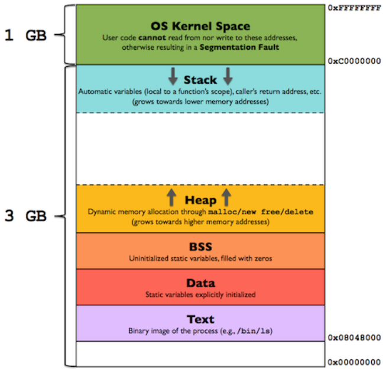

### Peter pregleduje disk, na katerem je datotečni sistem ext3. kot priden forenzik je najprej izračunal varnostno vsoto dd if=/dev/sdb1 | md5sum, nato je disk priklopil mount -o ro /dev/sdb1. Varnostni vsoti sta si različni! 1. Zakaj 2. Kaj pomeni stikalo -o ro 3. kaj bi moral storiti, da bi disk pregledal, ne da ga pokvari?

###### 1.

Podatki so različni, ker o se metapodatki diska spremenili. Spremenila se je vsaj informacija o zadnji vklopitvi diska.

###### 2.

stikalo -o ro, pomeni, da bo visk vklopljen v načinu read only.

###### 3.

Moral bi disk prekopirati brez da ga vklopi. md5sum -> dd/cat -> preverit md5sum kopije.

### Kaj pri datotečnem sistemu NTFS pomeni angleška kratica VDL? Kako lahko z uporabo VDL skrivamo podatke?

VDL ali Valid data length nam pove, do kje so podatki na disku pravilni, in od kje naprej so nepravilni. To lahko uporabljamo za skrivanje podatkov tako, da spremenimo VDL na manj in v skrite dele skrijemo podatke.

### Izrezovanje (carving) je edn postopkov iskanja podatkov v drugih podatkih (npr. datoteki). Recimo da smo slišali, da so podatki, ki jih ne moremo izrezati, program napisan v lupini *bash* ali slika v formatu .jpg. 1. zapišite hipotezo, ki jo boste preverjali. 2. Kako boste hipotezo preverili?

###### 1.

Hipoteza se glasi: Sklpamo, da so skriti podatki v formatu slike .jpg

###### 2.

Preverili jo bomo tako, da bomo iskali sledove podpisa .jpg datoteke. Če opazimo, te sledove v datoteki, pogledamo ali je na tem mestu jpg datoteka in jo preberemo, drugače pa gledamo naprej. Če pridemo do konca datoteke, lčahko predvidevamo da v datoteki ni skrita .jpg datoteka.

### Peter je v roke dobil Cefizljev računalnik. Sedaj bi rad ugotovil, ali se je Cefizelj priklapljal na butalsko lokalno mrežo. 1. Ali lahko iz usmerjevalne in AR tabele na računalniku ugotovi, če je bil računalnik na bulatski mreži? Če ja zakaj ja, če ne zakaj ne? 2. Kje bi Peter še lahko iskal podatek o tem, ali je bil ta računalnik prisoten na omrežju? 3. Kako bi brez dostopa do strežnikov pretentali Petra, da bi mislil,d aje bil Cefizljev računalnik na omrežju, čeprav je v resnici lo za računalnik nekoga drugega.

###### 1.

Da lahko bi pogledal, če MAC naslov kakšne naprave ustreza napravi v MAC tabeli. To nebi še 100% dokazalo, da se je povezal v to omrežje, razen, če ima v ARP tabeli MAC usmerjevalnika.

###### 2.

Peter bi lahko gledal v ARP tabelo usmerjevalnika, če je imel nastavljen dinamično dodeljevanje IP naslovov, je moral MAC Cefizljevega računalnika podati v svojo ARP tabelo.

###### 3.

Zamenjali bi MAC naslov računalnika na Cefizljev računalnik in se prijavili v omrežje.

### Petru na enem od računalnikov ne deluje mreža - računalnik ne dobi IP naslova. Ostali računalniki delujejo normalno, problematični računlanik pa na drugih mržah deluje normalno. Peter sumi, da je problem v strežniku DHCP. katere datoteke na strežniku naj pregleda. Naštejte vsaj 3 in zakaj?

Pregleda naj:

- /etc/dhcp/dhcpd.conf: datoteka vsebuje glavno konfiguracijo DHCP strežnika, kot so obseg IP naslovov, veljavnost zakupa (leases) IP naslovov in posebne opcije ki se pošiljajo nekaterim strankam.

- /var/lib/dhcpd/dhcpd.leases: datoteka vsebuje vse lease, ki jih je DHCP server naslovil. Te vključujejo IP naslov, MAC naslov in čas zakupa. Peter lahko pregleda, če se server pravilno obnaša

- syslog: To je sistemska datoteka, v kateri se hranijo zapiski o dogodkih v sistemu, vključno z DHCP dogodki. Peter lahko pogleda, če vsebuje kaj errorjev vezanih na DHCP.

### Preiskovalec je našel na osumljenčevem domačem računalniku slike z otroško pornografijo. Kaj lahko predpostavlja?

###### a) nekdo je iz interneta uspel neavtorizirano naožiti slike na računalnik

###### b) od domačih je z USB palčke ali s spleta naložil slike na računalnik

###### c) nekdo od domačih ima slike na svojem telefonu in jih je zložil na računalnik

###### d) nič od naštetega

d). Preiskovalec ne sme nič predpostavljati, lahko samo poda hipšotezo in jo poskuša potrdidi ali zavrči.

### V Butalah imajo tudi policista. Že dolgo je sumil cefizlja kraje recepta butalske soli. Tako se je odločil narediti pri njem preiskavo in je v preiskavi zasegel Cefizljev prenosni računalnik. Ker se mu je zeloudilo, ga je spravil v kovinski kovček in odnesel domov. Zveče, ko so vsi  spali je iz računalnika vzeldisk,ga priklpl v svoj računalnik, n atere poganja Ubuntu, i ga je prepoznal kot 2. SAT disk. Disk e pregledal in našel likoprootipa pve butalske pomornice.po krajšmiskanju je našl še nčrtepomornice terseznam delov, iz katerih ej sestavljena. Takoj je z ukazom *md5sum /dev/sdb1 > checksum.txt* izračunal varnostno vsoto, disk odklopil in postavil na polico v predsobi. Zjutraj je disk pobral in odnesel v službo, kjer ga je spravil v varen sef. Kaj vse je storil narobe?

Če je dobil vsa ustrezna dvoljenja za odvzem računalnika je storil sledeče napake:

- Ni dal računalnik v ustrezno embalažo, ter ni bil skrben pri pakiranju.

- Ni vzpostavil verige dokazov.

- Raziskave ni delal v laboratoriju

- Ni najprej naredil kopije diska in nato analiziral, zato je kontaminiral disk

- Ni ga dobro zaščitil čez noč

- prepozno ga je odnesel v slubo.

### Peter je napisal naslednji program:

```c
void foo() {
long int* f;
f = &f + 1;
printf("\%lx\n", *f);
}
int main() {
foo();
}
```

\1. kaj izpisana vrednost predstavlja? 2. Zakaj se vrednost ob vsakem zagonu spremeni? 3. narišite shemo naslovnega procesa tipičnega progarma, in označite, kje je izpisana vrednost. Shema naj vključuje, kje približno je program, kje podatki, in kje sklad.

###### 1.

Izpisana vrednost predstavlja vrednost naslednjega naslovnega prostora od inicializacije f naprej. To naj bi predstavljalo izhodno vrednost main() funkcije.

###### 2.

Vrednost se ob vsakem zagonu spremeni, ker ta prostor ni rezerviran in lahko vanj računalnik piše, kazalec se vsakič drugje inicializira.

###### 3.



Izpisana vrednost se zapiše v OS kernel space.

### V slovenskem pravnem sistemu imamo v kazenskem postopku sedem korakov. Kaštejte jih in napišite vlogo vsakega.

1. Predkazenski postopek: Ko policija izve za kaznivo dejanje, oz. ko ima utemeljen sum, da je bilo storjeno kaznivo dejanje, ki ga je storil določen storilec poda ovadbo državnemu tožilcu. 
   Državni tožilec lahko ovabdo:
   
   - zavrže (ni kaznivo dejanje)
   
   - vrne ovadbo policiji (ni dovolj dokazov)
   
   - sprejme ovadbo (s tem se začne kazenski postopek)

2. Sodna preiskava: Zbiranje podatkov, lahko se tudi pritoži na sklep o uvedbi preiskave

3. Vložitev obtožnice in preiskus obtožbe: Tožilec določi, kaj bo sodišče obravnavalo na glavni obravnavi, saj je določen obdolženec in dejanje, ki je predmet obtožbe.
   Ko državni tožilec vloži obtožnico ima obtoženec pravico vložiti svoj ugovor. Če zoper obtožnico ni bil vložen ugovor ali pa je ta bil zabrnjen, postavne pravnomočna.

4. Preobravnavni narok: Ko postane obtožnica pravnomočna, sodnik razpiše predobravnavni narok, kjer se obtoženec pred sodiščem izjavi o krivni. Ima dve možnosti:
   
   - Če krivdo prizna in sodnik priznanje sprejme, se takoj opravi še narok za izrek kazenske sankcije
   
   - Če krivde ne prizna, lahko predlaga še dodatne dokaze, predlaga izločitev listin iz spisa, izločitev sodnika, pove, ali želi, da mu sodi sodnik posameznik

5. Glavna obravnava: ob prisotnosti tožilca in obtoženca odloča sodišče, ali je obtoženec kriv za kaznivo dejanje

6. Postopek zoper pritožbo zoper sodbo: tožilec in obdolženec se lahko na sodbo pritožita v 8 dneh

7. postopek z izrednimi pravnimi sredstvi:
   
   - **Obnova postopka**: o tem odloča splošno sodišče
   
   - **Zahteva za varstvo zakonitosti**: o tem odloča vrhovno sodišče
   
   - **Zahteva za izredno omilitev kazni**: o tem odloča vrhovno sodišče
   
   Zoper zadeve, ki so odločene z izrednimi pravnimi sredstvi je mogoča samo še ustavna pritožba.

### Pri rokovanju z digitalnimi dokazi naletimo na več izzivov. Dva sta: a) ostanki ali rekonstrukcija ni enaka kot celotni podatki b) podatki niso večni. za vsakega od izzivov 1. pojasnite kaj pomeni in navedite primer. 2. pojasnite, kako ga pri digitalni forenziki poskušamo premagati.

###### 1.

a) Če poskušamo podatke znova predstaviti, niso nujno enaki kot so bili v originalu. Na primer imamo železno palico, ki je zarjavela tekom preiskave

b) Podatki niso nujno več dostopni. npr. DNK se je razgradil.

###### 2.

a) Pri DF poskušamo čim bolj natančno zajeti podatke. Pazimo, da se podakti med transportom v laboratorij ne izgubijo, delamo kontrolne vsote, da se gleda verodostojnost podatkov.

b) Poskušamo sistem zamrzniti in odklopiti od morebitnih virov motenj podatkov. Podatke moramo tudi zajeti v čimkrajšem času, da se ne pobrišejo.

### Peter poizkuša ustvariti forenzično kopijo svojega 2. SATA diska. Zaenkrat je pognal spodnji ukaz

```shell
dd if=/dev/sda2 of=img.raw bs=4096 count=4096
```

### 1. Katero napravo je dejansko skopiral (napišite, kaj ta naprava predstavlja)? 2. katero ime napravi bi bilo pravilno? 3. Razen imena naprave, kaj je v ukazu še narobe in kako naj to popravi?

1. sda2 predstavlja drugo particijo prvega sata diska. Če bi hotel dostopati do drugega diska, bi moral dati ukaz sdb1.

2. Pravilno ime bi bilo sdb1, če ima samo eno particijo.

3. Najprej mora pogledati, koliko blokov ima sdb disk. to lahko pogleda z ukazom fdisk in nato napiše v count število blokov.

### Peter poizkuša v svoj stari računalnik brez EFI spraviti nov, velik disk velikosti 6TB. Datotečni sistem in razdelke je ustvaril pri prijatelju, nakar ga je priklopil na svoj računalnik. Preveril je, da disk deluje brez težav in da lahko pride do podatkov. Ker se boji, da bo stari odpovedal, se je odločil, da bo poskrbel, da se sistem zaganja iz novega diska. S starega diska je skopiral GRUB na novega. Po ponovnem zagonu, ki je bil uspešen, se mu je računalnik pritožil, da na disku ni nobenega datotečnega sistema. Odpravil je napako in se odločil, da bo GRUB ostal na starem disku. 1. Kje na disku se običajno nahaja GRUB? 2. Kaj je Peter po nesreči prepisal? 3. Kako je obnovil prepisane podatke

1. GRUB (Gnu GRand Unified Bootloader) je boot loader oz. zagonsli nalagalnik za Unix sisteme. Z EFI se nahaja v /boot/efi, brez EFI pa se nahaja v /boot/grub/grub.cfg, ki se generira iz /etc/default/grub.

2. Ni prenesel podatkov o trenutnem datotečnem sistemu, ker je datotečni sistem že imel, zato tega operacijski sistem ni prepoznal?

3. Novi disk je formatiral, in v BIOS spet nastavil stari disk na pogonski.

### Microsoftov Windows vsebujejo VSS - Volume Shadow Copy. 1. kaj ta storitev omogoča? 2. Kako jo uporabimo pri digitalni forenziki?

###### 1.

VSS tehnologija omogoča, da se naredijo varnostne kopije ali pa posnetki datotek ali celotnik volumnov, tudi če so v uporabi.

###### 2.

To lahko uporabimo za pridobivanje podatkov, če so le ti bili izbrisani.ž

### Beleženje je ena od ključnih storitev v sodobnih operacijskih sistemih. Kako je urejeno vključno s tem, kje so podatki shranjeni 1. pod UNIX ter GNU/Linux sistemi in 2. na Microsoft Windows. Peter sumi, da je nekdo vdrl v njegov računalnik njegovega šefa, ki uporablja Windows. 3. kje naj išče dokaze vdora?

###### 1.

Pri unix operacijskih sistemih:
/var/log, /usr/local/var/log, /op/var/log

###### 2.

Na Windows sistemih:
%systemroot%\system32\config ali Windows\System32\winevt\logs*.evtx

###### 3.

V %systemroot%\system32\config bo našel podatke o zadnjih dostopih v sistem, to lahko stori tudi prek Event Viewer-ja. Tam bo videl, če je bilo do računalnika dostopano, ko šef ni bil v pisarni.

### Peter je dobil v skrb strežnik, za katerega je sodlej skrbel drugi. V /home/joze/.bash_history je peter našel naslednjo vrstico: telnet localhost splet. Ko je ukaz pognal je dobil  naslednji odgovor:

```shell
peter@slovnica: ̃/$ telnet localhost splet
Trying ::1...
Connected to localhost.
Escape character is ’ˆ]’.
GET /
A lepše od tele bilo ni nobene.
Connection closed by foreign host.
```

### Katera datoteka na sistemu je bla najvrjetneje spremenjena?

v /etc/services je nastavil preslikavo servicename (splet) na vrata 80.

### Peter poskuša analizirati Android mobilni telefon. Rad bi našel zgodovino brskanja in gesla za spletne storitve. 1. na kateri imenik je običajno priklopljen razdelek, ki vsebuje zgodovino brskanja po spletu? 2. ali peter lahko najde spletna gesla? s kakšno zgoščevalno funkcijo so zaščitena? 3. V katerem formatu je spravljena zgodovina brskanja pri chrome?

###### 1.

Priklopljen je na razdelek /data (/data/com.android.browser)

###### 2.

Lahko. Locirane so v appdata/.../Login Data. Enkriptirana so z HMAC in naključnimi sejnimi ključi.

###### 3.

V formatu SQLite.

### Pameten in navaden mobilni telefon. 1. Podatje dve hipotezi za digitalno preiskavo, ki bi bili enaki pri obeh tipih naprav. 2. Podajte eni hipotezo, ki velja le za pametne telefone in eno, ki velja le za navadne telefone.

###### 1.

a) Peter je pošiljal SMS-e za kupovanje droge na SMS

b) Peter je klical dilerja drog 2-kreat na teden.

###### 2.

a) Peter je na črnem spletu brskal za vsebine povezane z drogo

b) nevem res.

### Policist je na Cefizljevem računalnioku naletel na fotografije pergamenta z receptom butalske soli. Po butzalski zakonodaji je posest recepta najstrožje kazniva. Ker Cefizlja ni na spregled, je Peter vprašal slavno butalsko bolho , kako bi se tak recept lahko znašel na cefizljevem računlaniku. Dala mu je 3 možnosti: 1. Cefizelj je recept morda pretihotapil na USB ključku 2. Morda je sliko ustvaril z mobilnim telefonom, kjer še vedno obstaja kopija 3. morda je imel pajdaša, ki je skrivnost pretočil iz Butal s pomočjo interneta. Kateri od bolhinih predlogov je pravilen, kateri napačen, in kar je najpomembneje, zakaj?

Zaenkrat še nevemo, kateri od bolhinih predlogov je pravilen, saj moramo najprej postaviti hipoteze, ter jih potrditi ali ovrči. Lahko je pravilen vsak od teh predlogov, zato je treba vsakega od njih preveriti. Pri raziskavi ne smemo predpostavljati hipoteze v naprej.

### Kaj je forenzična preiskava in kaj vključuje?

Forenzična preiskava je preiskava, v kateri poizkušamo s pomočjo forenzičnih tehnik potrditi ali ovrči hipoteze.
Sestavljena je iz naslednjih korakov:

1. Priparava: Pripravimo načrt preiskave
2. pregled/identifikacija: Določimo, kaj je potrebno zajeti in kako bomo te podatke zajemali
3. Shranjevanje: Poskrbeti moramo za forenzično korektnost zajetega gradiva
4. Raziskava in analiza: Zajeto gradivo se ustrezno pripravi na analizo, ki temelji na ustreznih znanstvenih metodah
5. Predstavitev gradiva: Izsledke preiskave se ustrezno namenu predstavi (sodišče, v podjetju, vojska,...)

### Drugi princip navodil ACPI pravi: V izjemnih primerih, ko preiskovalec smatra, da je potrebno do podatkov dostopati na dokaznem računalniku, mora oseba, ki do podatkov dostopa, biti za to usposobljena ter posobna pojasniti pomen in posledice svojih dejanj. Kaj menite o tem principu? podatje dva primera za in dva proti.

Dostopanje do originalnih podatkov je vedno riskantno, ker vedno obstaja grožnja, da se podatki izgubijo.

ZA:

- V primeru, da se podatki ne morejo prenesti na drug medij, nimamo druge možnosti kot da dostopamo do originalnih podatkov, npr. disk je zakodiran

- Če računalnik ni zaščiten z geslom je bolje da dostopamo do originalnih podatkov

Proti:

- V primeru, da študent dostopa do originalnih podatkov, princip ne deluje, ker študent ni kvalificirana oseba

- Profesionalec lahko svoje sosobnosti preceni in naredi škodo na originalnih podatkih

### Cefizelj bi rad ukradel geslo Petru iz računlanika kjer tečejo Windows 7. Na žalost ima možnost prenesti le eno datoteko. 1. Katero datoteko naj skopira, da dobi petrovo geslo? 2. Katero dodatno datoteko mora prenesti če ga zuanimajo osebne nastavitve? 3. Ali bo ta datoteka vsebovala zgodovino brskanja? če da kje? Če ne, kje je drugače shranjena?

1. Kopirati bi moral datoteko C:\Windows\System32\Config\SAM, kjer so shranjena gesla in zgoščene vrednosti gesel.

2. Za osebne nastavitve bo moral kopirati C:\Users\Peter\NTUSER.DAT

3. Ne bo. Zgodovina brskanja je shranjena drugje za vsak brskalnik npr. Appdata\Local\Google\Chrome\User Data\Default\History in je v SQLite obliki.

### Kakšen je razpon časovnih značk na datotečnem isstemu ext2? Utemeljite oz. podrobneje opišite format zapisa datuma na ext2.

Čas se meri v sekundah - t.i. Unix time. Hrani se število sekund, od 1.1. 1970. Ker se hrani kot 32-bitno število, bo prišlo do preliva 19.12.1038.

### Cefizelj ima disk, ki uporablja NTFS. 1. Postavite in utemeljite 3 različne hipoteze, kje bi lahko cefizelj skril podatke na disku. 2. za vsako od hipotez utemeljite kako bi preverili.

###### 1.

1. Cefizelj bi lahko na datoteki podal atribut skrite datoteke, ker NTFS to omogoča.

2. Cefizelj bi lahko skril podatke v drugi datoteki npr. v powerpoint prezentaciji, ali sliki.

3. Cefizelj bi podatke lahko skril v drugo datoteko s tem, da ji spremeni VDL, in s tem datoteka izgleda manjša kot je.

###### 2.

1. Pogledamo datoteke, ki imajo skriti atribut.

2. Pregledamo skozi vse datoteke, če je kakšna čudno velike velikosti.

3. Z podrobno analizo diska gledamo, če kje opazimo izvorne datoteke.

### Luka je skoraj 95%  IP prometa imel do naslova abc.butale.si, iz kjer je ukradena slika soli. Tožilec luko obsodi. Navedite in utemeljite 2 možna razloga, zakaj je luka legitimno pogosto komuniciral z omenjenim naslovom

1. Luka je lahko bil tarča hekerskega napada in je njegov računalnik okužen, ter ga pod kontrolo ima tisti, ki je ukradel recept za sol. Luka je nevede s spleta prenesel virus, ki ej dal napadalcu popolno kontrolo nad računlanikom in s tem veliko prometa iz smeri Lukovegfa računalnika

2. Luka je lahko velik oboževatelj storitev, ki jih ponuja abc.butale.si, drugih spletnih strani pa ne uporablja. Lahko ima tudi star računalnik, ki ne komunicira z microsoftovimi ali drugimi spletnimi storitvami.ž

### Radi bi ugotovili, na katerem naslovu je bil petrov računalnik ko ej včeraj dostopal do Interneta. Kam se ne splača pogledati?

###### a) v dnevnik na usmerjevalniku

###### b) izpis ukaza ifconfig

###### c) syslog na Petrovem računalniku

###### d) v tabelo dodeljenih naslovov strežnika DHCP

V tabelo dodeljenih naslovov strežnika DHCP ne potrebujemo gledati, ker imamo te podatke že v syslog.

### Katera napaka je najbolj pogosta, ki se dela pri zajemu dokazov in nato prepreči uporabo dokaza na sodišču?

Pridobitev dokaza brez pooblastil. To se zgodi, ko nekdo zajame dokaze, ki za trenutno preiskavo niso relevantni. To je napaka zato, ker se s tem krši pravico ljudi do osebnih podatkov, ki ne smejo biti kar tako dostopni nekomu, ki nima pooblastila za dostop do njih in njihovo analizo.

### Peter je j obdelavo dobil USB ključ. Vtaknil ga je v računalnik in ga priklopil in ugotovil, da je na njem samod atotečni sistem ISO9660. Šele potems e je spomnil da mora delati s ssliko diska. 1. Ali ej s priklopom spremenil podatke na ključu? 2. Če bi hotel narediti sliko kljkučka

###### 1.

Da pokvaril je razne zabeležke o zadnjih dostopih do direktorijev. Čas zadnjega mounta, ...

```shell
sha512sum /dev/disk
cat /dev/disk > kopija.img
modprobe nbd max_part=32
qemu-nbd /dev/nbd0p1 kopija.img
mount /dev/nbd0p1 /mnt/disk
```

### Peter bi rad shranil kar je ostalo od izbrisane datoteke v eno datoteko na svoj disk. Peter poganja Linux OS in ima ext3 datotečni sistem, ki je nastavljen da vodi celoit dnevniški zapis (journal). 1. Koliko inode vozlišč bo uporabil? 2. Zapišite in utemeljite kakšni zapisi vse se hranijo v dnevniku? Pri opisu transakcije navedite kateri bloki se kdaj shranijo.

1. Če bo shranil v eno datoteko, potrebuje 1 inode, kjer bodo vsi kazalci na podatke in metapodatki ter časovni zabeležki o tej novi datoteki.

2. Če imamo polni journal, se shranjujejo metapodatki o operaciji na disku in tudi podatki, ki so se v tej transakciji spremenili (to se oboje zgodi pred opravljeno transakcijo)

### Peter je kupil dva diska po 3 TB. Nanju bi rad spravil %TB podatkov, vsaj 500GB ima takšnih,. ki jih ne bi rad zgubil. 1. Predlagajte dve tehnologiji, ki jih lahko uporabi 2. Za eno od njiju natančno opišite, kako naj na diskih ustvari razdfelke, dat. sisteme, ...

###### 1.

Če hočemo imeti podatke na varnem lahko uporabimo LVM ali RAID, s pravilnimi konfiguracijami, ki bodo razdelile diske na več razdelkov, ki bodo pravilno povezani, da bodo nekateri obvarovali podatke.

###### 2.

V tem primeru lahko naredimo en logičen volumen RAID 1, velik 500GB (Ki bo na obeh diskih zavzel 500GB, skupaj 1TB). Za ta namen naredimo po en razdelek na vsakem disku in ju povežemo v RAID 1 konfiguracijo.

Drugi volumen, pa lahko RAID0 na obeh diskih, ki bo dal skupnega prostora 5TB.
