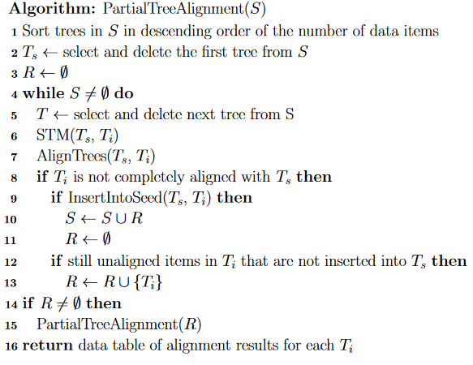

- [SPLETNI PAJKI](#spletni-pajki)
  - [Arhitektura](#arhitektura)
    - [Osnovna arhitektura](#osnovna-arhitektura)
    - [Pajki z iskanjem v širino](#pajki-z-iskanjem-v-širino)
    - [Zgodovina pajka](#zgodovina-pajka)
    - [Preferenčni pajki](#preferenčni-pajki)
  - [Implementacija](#implementacija)
    - [Zajem strani](#zajem-strani)
    - [Razčlenjevanje](#razčlenjevanje)
    - [Odstranjevanje stopwordov in stemming](#odstranjevanje-stopwordov-in-stemming)
    - [Ekstrakcija povezav in kanonizacija](#ekstrakcija-povezav-in-kanonizacija)
    - [Pajkove zanke](#pajkove-zanke)
    - [Repozitorij](#repozitorij)
    - [Paralelno delovanje](#paralelno-delovanje)
  - [Univerzalni pajki](#univerzalni-pajki)
    - [Zajemanje vs. svežina vs pomembnost](#zajemanje-vs-svežina-vs-pomembnost)
      - [Skalabilnost](#skalabilnost)
  - [Fokusirani pajki](#fokusirani-pajki)
    - [Klasifikacija fokusnega pajka](#klasifikacija-fokusnega-pajka)
    - [Klasifikacija z naivnim bayesom](#klasifikacija-z-naivnim-bayesom)
      - [Kontkekstualni fokusirani pajki](#kontkekstualni-fokusirani-pajki)
  - [Tuneliranje](#tuneliranje)
  - [Tematski pajki](#tematski-pajki)
    - [Leksikalna podobnost](#leksikalna-podobnost)
    - [Podobnost povezav](#podobnost-povezav)
    - [Načini izračuna](#načini-izračuna)
    - [Best n-first pajek](#best-n-first-pajek)
  - [Adaptivni pajki](#adaptivni-pajki)
    - [Inteligentni pajek](#inteligentni-pajek)
    - [Tematski pajek, ki uporablja spodbujevalno učenje](#tematski-pajek-ki-uporablja-spodbujevalno-učenje)
      - [Problemi:](#problemi)
        - [Značilnosti strani in povezav:](#značilnosti-strani-in-povezav)
        - [Priotiziranje](#priotiziranje)
        - [Linearna aproksimacija](#linearna-aproksimacija)
    - [Evalvacija pajkov](#evalvacija-pajkov)
      - [Metrike](#metrike)
        - [Metrike na osnovi natančnosti](#metrike-na-osnovi-natančnosti)
        - [Dolžina zajema](#dolžina-zajema)
        - [Metrike na osnovi priklica](#metrike-na-osnovi-priklica)
        - [Kritični resursi](#kritični-resursi)
    - [Etika pajkov](#etika-pajkov)
- [Strukturirana ekstrakcija podatkov](#strukturirana-ekstrakcija-podatkov)
  - [Sheme](#sheme)
    - [Problemi:](#problemi-1)
  - [DOM](#dom)
    - [Kaj DOM je:](#kaj-dom-je)
  - [Aplikacije avtomatske ekstrakcije](#aplikacije-avtomatske-ekstrakcije)
    - [Sistem za ekstrakcijo](#sistem-za-ekstrakcijo)
      - [Vidiki sistemov za ekstrakcijo](#vidiki-sistemov-za-ekstrakcijo)
      - [Aplikacije sistemov za ekstrakcijo:](#aplikacije-sistemov-za-ekstrakcijo)
  - [Tehnike ekstrakcije vsebine](#tehnike-ekstrakcije-vsebine)
    - [Vzklajevanje dreves in stringov](#vzklajevanje-dreves-in-stringov)
      - [String edit distance](#string-edit-distance)
      - [Jaro podobnost](#jaro-podobnost)
      - [Jaro winkler podobnost](#jaro-winkler-podobnost)
      - [Tree edit razdalja](#tree-edit-razdalja)
  - [Večkratno usklajevanje](#večkratno-usklajevanje)
    - [Center star method](#center-star-method)
    - [Delna poravnava dreves](#delna-poravnava-dreves)
    - [Grajenje DOM dreves](#grajenje-dom-dreves)
      - [Ekstrakcija podatkov](#ekstrakcija-podatkov)
    - [Izzivi pri ekstrakciji](#izzivi-pri-ekstrakciji)
  - [Iskanje podatkovnih seznamov](#iskanje-podatkovnih-seznamov)
    - [Definicije](#definicije)
      - [Vsebinski elementi v podatkovnih seznamih](#vsebinski-elementi-v-podatkovnih-seznamih)
    - [Povežemo vsebinske elemente med seboj](#povežemo-vsebinske-elemente-med-seboj)
      - [Ekstrakcija večih spletnih strani](#ekstrakcija-večih-spletnih-strani)
      - [RoadRunner algoritem](#roadrunner-algoritem)
      - [Slabosti z avtomatsko ekstrakcijo](#slabosti-z-avtomatsko-ekstrakcijo)
  - [Spletne ovojnice](#spletne-ovojnice)
    - [xPath - XML Path language](#xpath---xml-path-language)
      - [Problemi z vzdrževanjem ovojnice](#problemi-z-vzdrževanjem-ovojnice)
        - [Visual box model](#visual-box-model)
- [INFORMACIJSKO POIZVEDOVANJE](#informacijsko-poizvedovanje)
  - [Modeli informacijskega poizvedodanja](#modeli-informacijskega-poizvedodanja)
  - [Formalizacija](#formalizacija)
    - [Logični model](#logični-model)
    - [Vektorski model](#vektorski-model)
      - [Izračun relevantnosti](#izračun-relevantnosti)
  - [Statistični jezikovni model](#statistični-jezikovni-model)
    - [Glajenje](#glajenje)
  - [Upoštevanje povratne informacije](#upoštevanje-povratne-informacije)
    - [Rocchio metoda](#rocchio-metoda)
    - [Rocchio kasifikator](#rocchio-kasifikator)
    - [LU learning](#lu-learning)
    - [PU learning](#pu-learning)
    - [Pseudo feedback](#pseudo-feedback)
    - [Vektorske vložitve besed](#vektorske-vložitve-besed)
      - [One hot encoding](#one-hot-encoding)
    - [Word2Vec](#word2vec)
      - [Kako vektorske vložitve uporabljamo v informacijskem poizvedovanju?](#kako-vektorske-vložitve-uporabljamo-v-informacijskem-poizvedovanju)
    - [Invertni indeks](#invertni-indeks)
    - [Trie podatkovna struktura](#trie-podatkovna-struktura)
      - [Trie konstrukcija za splet](#trie-konstrukcija-za-splet)
  - [Dodatni indeksi](#dodatni-indeksi)
  - [Kompresija indeksa](#kompresija-indeksa)
    - [Kompresiranje celih števil](#kompresiranje-celih-števil)
      - [Dekodiranje](#dekodiranje)
        - [Empirično testiranje](#empirično-testiranje)
  - [Latentna semantična analiza - LSI](#latentna-semantična-analiza---lsi)
    - [Formalizacia](#formalizacia)
    - [Zmanjšanje konceptnega postora](#zmanjšanje-konceptnega-postora)
      - [Poizvedovanje in iskanje v LSI](#poizvedovanje-in-iskanje-v-lsi)
      - [Primerjava LSI in drugih metod](#primerjava-lsi-in-drugih-metod)
      - [Spletno iskanje](#spletno-iskanje)
  - [Rangiranje](#rangiranje)
    - [Rangiranje na oslovi vsebine](#rangiranje-na-oslovi-vsebine)
      - [Enobesedne poizvedbe](#enobesedne-poizvedbe)
      - [Večbesedne poizvedbe](#večbesedne-poizvedbe)
    - [Reputation score](#reputation-score)
    - [Prestiž](#prestiž)
    - [PageRank](#pagerank)
      - [Modeliranje spleta z markovskimi verigami](#modeliranje-spleta-z-markovskimi-verigami)
    - [Ergodijev teorem za markovske verige](#ergodijev-teorem-za-markovske-verige)
      - [Stacionarna vrjetnostna distibucija](#stacionarna-vrjetnostna-distibucija)
    - [Prednosti in slabosti PageRank](#prednosti-in-slabosti-pagerank)
  - [Luščenje](#luščenje)
    - [Tehnika](#tehnika)

# SPLETNI PAJKI

## Arhitektura

### Osnovna arhitektura

Vsak spletni pajek vsebuje:

- Frontier (frontier) -  vanj se zapisujejo URL-ji, ki so naslednje na vrsti za obdelavo

- Semenske strani - strani iz katerih izvira naš pajek

- Repozitorij -  vanj se shranjujejo informacije, ki jih je pajek pridobil

- Implementacija:
  
  - Shranjevanje URL-jev
  
  - Strategija izbire URL-jev
  
  - Strategija, če je Frontier poln

- Izzive in omejitve

### Pajki z iskanjem v širino

- Frontier se polni na podlagi FIFO principa - prvi notri prvi ven

- Zaradi tega mora Frontier imeti omejeno velikost

### Zgodovina pajka

- Razlogi, zakaj mora pajek imeti zgodovino:
  
  - Ne želimo obistaki isto stran večkrat
  
  - Poveča učinkovitost, ker se iz zgodovine lahko učimo

- Implementacija v RAM-u ker potrebujemo veliko hitrost - Uporabljamo razpršene tabele (hash table)

- Potrebujemo tudi iskanje duplikatov

### Preferenčni pajki

- Ti pajki gredo preferenčno rajši v nekatere strani kot druge

- Pomembno je, da se zavedamo:
  
  - Okolice preference: topologija spleta, vsebina strani
  
  - Izbira semenskih strani

- Pajek mora imeti možnost sortiranja:
  
  - Sortiran dinamični seznam in Hash table

- Časovna kompleksnost je večja kot pri osnovnih pajkih

- Imenujemo jih tudi **Best-first** pajki

## Implementacija

Implementacija pajka vsebuje:

- Zajem strani (fetching)

- razčlenjevanje (parsing)

- odstranjevanje stopwordov in stemming

- Ekstrakcija linkov in kaknonizacija (canonicalization)

- Izogibanje zankam

- Realizacija repozitorija

- Sočasnost

### Zajem strani

- Spletni pajek se obnaša kot spletni odjemalec.

- Omejimo čas čakanja na odgovor in velikost.

- Pomagamo si lahko z HTTP glavami, ki nam dajo lahko pomembne podatke

- Detekcija in odprava napak

- Vodenje statistike

### Razčlenjevanje

- Pomembno je, da izluščimo povezave in naredimo analizo vsebine

- Pri razčlenjevanju si pomagamo s tem da pretvorimo dokument v DOM
  
  - Najprej pošistimo HTML in naredimo DOM
  
  - Notri poiščemo značke in odstranimo vse dele, ki se ne nanašajo na vsebino

- Datoteke ne bodo vedno v HTML formatu.
  
  - Ponavadi to vidimo v HTML headerju

### Odstranjevanje stopwordov in stemming

- Eliminacija besed brez pomena, dodane vrednosti

- Stemming - Besede spravimo v določeno obliko:
  
  - Pretvorimo besedo v koren besede: running, runs -> run
  
  - Boljša je lematizacija, ki pretvori besedo v svojo korensko obliko.

- POS tagging - Oblikoslovno označevanje
  
  - Classla -> stanza
  
  - NLP -> procesiranje naravnega jezika
  
  - primer: dan->sme1, Martin->IOme1
  
  - besedne vrste:
    
    - S, I - samostalniki
    
    - G - glagoli
    
    - P - pridevniki
    
    - Z - zaimki, ...
  
  - Oblikoslovne kategorije:
    
    - spol(m, ž, s), število(e, d, m), sklon(i, r, d, t, m, o), oseba(1., 2., 3.), stopnjevanje, določnost in razmerje

### Ekstrakcija povezav in kanonizacija

HTML je možno spraviti v hierarhično DOM obliko, ki omogoči lažjo ekstrakcijo povezav.

Filtriranje: Moramo vedeti, katere povezave so spletne strani, ne pa drugi dokumenti. Tega ne moremo zanesljivo vedno vedeti samo iz povezave.

Avtonomno poizvedovanje: Brska po skritem spletu prek queryjev

URL naslove moramo normalizirati, zato, da se izognemo duplikatom

### Pajkove zanke

Zanka: Pajek se vedno giblje po istih straneh.

Zgodi se takrat, ko se strani avtomatsko generirajo.

Reševanje:

- Ne spremejamo piškotkov (cookijev)

- Omejimo dolžino URL-ja

- Omejimo število strani iz določene domene

### Repozitorij

Ko enkrat strani zajamemo, moramo strani shraniti v

- Bazo:
  
  - Vse v eni datoteki, lahko poizvedovanje

- V svojo datoteko:
  
  - Hashiramo strani -  da nimamo dupoliaktov:
    
    - Velik overhead za OS
  
  - Veliko strani v eni datoteki:
    
    - Potrebujemo mapiranje

### Paralelno delovanje

Izkorišča računalnišče vire do polne zmogljivosti:

- Uporabimo več-procesorsko delovanje

- Uporabimo več-nitno delovanje

Potrebujemo Frontier managerja, ki poskrbi, da bo en proces bral ali pisal iz Froneiterja naenkrat.

## Univerzalni pajki

Univerzalni pajki morajo obiskati več sto tisoč strani na sekundo

Zaradi tega potrebujemo visoko skalabilnost v vse strani.

Cilj univerzalnega pajka je:

- Zajeti čim več strani

- Ne pozabiti pomembnih strani

- Imeti čim bolj sveže podatke

#### Zajemanje vs. svežina vs pomembnost

Indeksirati hočemo celoten splet

Moramo imeti pomembnostne metrike - (in-degree, PageRank)

Do nothing approach: Če merimo pomembnost z količino vhodnih povezav, bomo slej kot prej prišli v to stran

Če hočemo imeti statistično pravilen vzorec spleta:

- Ne sme biti odvisna samo od vhodnih povezav

- $P_r(accept(p)|crawl(p)) * P_r(crawl(p))$

- $Pr(accept(p)|crawl(p)) = \frac{1}{PageRank(p)} = \frac{1}{f(p)}$

### Skalabilnost

Uporabljajo množico izboljšav pred običajnimi pajki:

- Asinhrona vrata - ne blokirajo komunikacije, več vrat odprtih na vsaki niti

- Več URL vrst, ne potrebujemo še enkrat opravljati TLS handshake

- Uporaba DNS:
  
  - Uporaba UDP - ni varen, a ne potrebujemo
  
  - Uporabljamo hiter predpomnilnik
  
  - Uporabimo predpomnenje

- Uporaba več povezav hkrati

- Uporaba SAN (Storage switch)

## Fokusirani pajki

- ODP shranjuje dobre spletne strani izbranih kategorij

- Fokusirani pajek išče strani, ki ustrezajo izbranim kategorijam in dopolnjuje indeks

- Fokusirani pajki imajo za razliko od Tematskih pajkov že velik kontekst dobrih spletnih strani, ki so kategorizirane.

#### Klasifikacija fokusnega pajka

- Za vsako kategorijo bi lahko izdelali klasifikator:
  
  - Vsaki strani izračunamo vrjetnost da spada v nekatero kategorijo - Relevance Score
  
  - V frontierju imamo strani razvrščene po seštevku vrjetnosti da spada v katero kategorijo

- Šibka strategija:
  
  - Analiziramo stran in te URLje napišemo v frontier z Relevance scori.

- Stroga strategija:
  
  - Najprej poišče kategorijo, ki je v listu in izračuna verjetnost, ter izbere list z največjo vrjetnostjo
  
  - Pogledamo, če je list sam ali njegov prednik v kategoriji, ki jo iščemo, ga dodamo, drugače pa ne.

#### Klasifikacija z naivnim bayesom

- $P_r(c|d) = \frac{P_r(d|c)*P_r(c)}{P_R(d)}$, kjer je **$c \in C$** kategorija iz množice kategorij **$C$** in **$d$** predstavlja stran, ki smo jo obiskali.

Za potrebe poizvedovanja po dokumentu imamo naslednjo enačbo:

- $P_r(c|d) \approx P_r(c) \prod_{i=1}^{|V|} P_r(w_i|c)^{f_{w_i}}$, kjer je $V$ slovar posameznih besed **$w_i$** in dokument **$d$**, ki ga hočemo klasificirati, **$f_{w_i}$** je frekvenca besed $w_i$ v $d$

### Kontkekstualni fokusirani pajki

Zaradi nerelevantnosti trenutne strani nehamo iskati po tej poti.

Pomaga si s sklepanjem z uporabo kontekstnega grafa - hranimo povezave med stranmi. Procedura:

- Za vsak nivo kontekstnega grafa želimo klasifikator, ki pove vrjetnost, da stran spada na določen nivo

## Tuneliranje

Izhajamo iz omejitev Best-first pajkov.

vprašanja:

- Katerim stranem slediti?

- Do kdaj slediti neki poti (na kateri bodo vmes tudi slabe strani)?

- Kako ugotavljati, da je neka pot perpektivna?

**Koncepti:**

- Dobre strani (relevantne strani) - o

- Slabe strani (nerelevantne strani) - x

- Pot  - je sekvenca od ene dobre strani do druge dobre strani (oxxxxo)

- meja podobnosti (threshold) - minimalna podobnost z kategorijo, da je dobra stran

- cutoff (max dožina poti)

- dolžina - od zadnje dobre strani

dolžina(p) = 0 if p relevantna; 1 + dolžina(parent(p))

Ugotovtve raziskave:

- Najpogostejša razdalja med dvema dobrima stranema je 7-8.

- Boljši starši imajo boljše otroke, obratno ne velja

- Zaporedje dobrih strani je dober indikator, da je stran perspektivna - če so 3 dobre strani zapored in nato ena slaba, je dober indikator, da nadaljujemo po tej poti.

- Predlagali so formulo:
  dolžina(p) = 0 if p relevantna;$min(1, (1-c)e^{\frac{2d_p}{C}})$ , kjer $d_p$ razdalja starša, $c$ - trenutna korelacija, $C$ - cutoff

## Tematski pajki

1. Omejeno znanje o temi, ki jo iščejo | ključne besede, spletna stran

2. Iščemo v realnem času (ni indeksa)

3. Učimo se sproti

**Prednosti:** Zelo sveži podatki

**Slabosti:** Počasnejši, manj natančni

**Signali / informacije**, ki jih tematski pajek lahko upošteva:

- Leksikalna podobnost

- Topološka podobnost / podobnost povezav

- Semantična podobnost

### Leksikalna podobnost

p1 in p2 sta podobni, če imata podobno vsebino.

Če je p1 relevantna, in je p1 podoben p2 => velika vrjetnost, da je p2 relevantna.

### Podobnost povezav

Če sta p1 in p2 podobni po povezavah, potem sta si blizu:

- sta povezani

- imata podobne strani, ki na njiju kažejo (in-link)

- Kažeta na podobne strani (out-link)

**Indici iz povezav:**

1. kocitiranost - če imata strani podobne cicate, sta si strani podobni

2. stičišča - spletne strani, ki kažejo na dobre strani -> če stičišče kaže na stran, sklepamo da je dobra

3. Bibliografska podobnost - če stran kaže na iste strani kot dobra stran, sklepamo da je dobra (obratno od kocitiranosti)

### Načini izračuna

1. Leksikalna podobnost: TF/IDF + kosinusna podobnost

2. Podobnost po povezavah: bag of links - vreča povezav -> Jaccardova podobnost

3. Semantična podobnost: ODP

Variacije princiap gibanja BEST-first:

- Naivni BF pajek: TF-IDF

- Infospider, Clevercrawler, Sharksearch: tekst URL, pozicija besed v DOM, tagi, ...

### Best n-first pajek

Eksploracija - raziskovanje

Eskplotacija - sledenje strategiji naučeni iz zgodovinskih podatkov / preteklosti

Kako deluje?

- Iz frontierja vzame n najboljpih URL-jev

- Vse obdela in vse najdene UR-je da v frontier

## Adaptivni pajki

Značilnost: prilagajajo ali spreminjajo strategijo, gre se za inkrementalno učenje.

Algoritem:

1. izbira značike (lambda fei)

2. zajemi n strani

3. preračunaj faktorje interesa

4. ponovno razvrsti URL-je v frontierju

### Inteligentni pajek

primer pajka z adaptivno strategijo

Značilke:

- vsebina (ključne besede)

- URL tekst

- število že obiskanih strani ki kažejo na P

- Relevantni kocitati

### Tematski pajek, ki uporablja spodbujevalno učenje

Cilj:

- Izbrati čim več relevantnih strani in se izogibati irelevantnim

- Izbrati mora povezavo, ki bo pripeljala do relevantne strani na dolgi rok

##### Problemi:

- Spletnih strani je zelo veliko, zato strani, ki imajo podobne lastnosti grupiramo v skupna stanja

- Povezav je tudi veliko iz vsake strani, zato jih več skupaj povežemo v isto akcijo

###### Značilnosti strani in povezav:

- Strani in povezave:
  
  - Relevantnost strani za ciljno temo in izbrane kategorije
  
  - Relevantnost, glede na spremembo kategorije
  
  - Povprečna ustreznost nadrejenih strani
    
    - Vsaka neobiskana povezava mora hraniti informacije o prejšnjih straneh
  
  - Oddaljenost od zadnje ustretne strani

###### Priotiziranje

Prioritetno spreminjamo vrednosti stanj (množic strani).

Pajek vedno izbere najboljšo stran v frontierju, zato skače po spletu, ni tuneliranja.

###### Linearna aproksimacija

Ker je q-tabela prevelika, te vrednosti ocenjujemo s pomočjo gradientnega spusta.

zadnjič -> kako naredit pajka, ki uporablja spdbujavalno učenje, da se premika po spletu, ima boljše rezultate-> boljše se premika po relevantnih straneh

### Evalvacija pajkov

- Evalvacija prek 
  
  - aplikacij -> ključna aplikacija je iskalnik
  
  - algoritmov

- Predpogoji:
  
  - Zadostno število poizvedb
  
  - Zadostno število tematik
  
  - Metodologije, ki upoštevajo dinamičnost spleta

- Izziv:
  
  - Nimamo splošno priznanih množic za evalvacijo -> Relevantnost zato ocenjujemo. Kako?
    
    - Število ključnih besed, ki se pojavijo v dokumentu.
    
    - Frekvenca ključnih besed na strani
    
    - Kosinusna razdalja
    
    - Klasifikator
    
    - N-pajkov
    
    - Metrike na osnovi prestiža - PageRank, HITS

#### Metrike

Natančnost: $P = {TP \over TP + FP}$, TP = true positive, FP = false positive

Priklic: $P = \frac{TP}{TP+FN}$, TP = true positive, FN = false negative

###### Metrike na osnovi natančnosti

- Harvest rate: $št. relevantnih \over št. obiskanih$

- Povprečna relevantnost

###### Dolžina zajema

 Koliko korakov moramo narediti za N relevantnih strani

###### Metrike na osnovi priklica

1. Štejemo relevantne strani (omejimo se s časom ali številom korakov), brez normalizacije

2. Kot izhodišče vzamemo klasificirane strani npr. ODP -> pomaknemo se N korakov proč.

###### Kritični resursi

Katere kritične resurse (CPU, pomnilnik, ...) uporablja in v kolikšni meri

### Etika pajkov

1. Frekvenca klicov na domeno: 1 na sekundo

2. Etiketa pajka: 
   
   - el. naslov, Ime in priimek
   
   - namen pajka

3- Robots.txt - Administrator pove, do kje lahko kakšen pajek dostopa.

# Strukturirana ekstrakcija podatkov

Vsebina spletnih strani ni natančno strukturirana in urejena. Računalniki težko razberejo kje je naslov, tekst, ...

Ovojnica (wrapper) - algoritem, postopek, ki definira kako se prenese naslov, vsebina, avtorji, linki, ...

Luščenje (screen scraping) - Proces ekstrakcije podatkov, ki uporablja ovojnico.

Pristopi:

- Neka množica pravil

- Avtomatizirani pristopi

- Pristopi, ki uporabljajo strojno učenje

Za vsak blok iz spletne strani hočemo pridobiti podatke in vedeti, kateri podatki izmed teh so pomembni.

Obdelavo naravnega jezika delamo, da dobimo dodatne informacije iz teksta, ne samo tekst.

## Sheme

Sheme je težko razviti za vsako domeno. Če bi bili vsi dokumeti v XML shemi, ne bi potrebovali avtomatske ekstrakcije podatkov.

### Problemi:

- Anotacije

- Uporabniki, ki e upoštevajo predpisov

Ekstrakcija informacij omogoča način ekstrahiranja podatkov iz nestrukturiranih ali delno strukturiranih fivov v strukturiran format.

## DOM

DOM (Document Object Model) definira posamezne oznake, funkcionalnosti posameznih oznak, ...

Po DOM modelu je vsak HTML tag objekt. Ti tagi so otroci tagov, ki jih zapirajo.

Pri ekstrakciji pomaga, če splčetno stran najprej pretvorimo v DOM drevo.

Vzorci za ekstrahiranje se lahko specificirajo kot poti iz korena DOM drevesa, do lista, i vsebuje informacije:

- Primeri teh so xPath in xQuery.

Nadaljno procesiranje besedila je lahko potrebno za dejansko ekstrahiranje besedila.

### Kaj DOM je:

- Objektni model za HTML.
  
  - Za vsak HTML objekt definira lastnosti, metode, dogodke (events)

- Obstaja API za Javascript:
  
  - Dodajamo, brišemo, spreminjamo HTML elemente in dodajamo ali reagiramo dogodke (events)

## Aplikacije avtomatske ekstrakcije

Primerjava cen izdelkov v različnih trgovinah:

- Ceneje.si

- Uporabnik na eni strani lahko vidi cene v večih trgovinah in vidi, kje je najceneje.

- Dva pristopa:
  
  - Online pristop: za vsako trgovino imamo definirano ovojnico, ko nek uporabnik napiše poizvedbo jo preberemo in gremo čez vsako trgovino, izvedemo poizvedbo in vrnemo podatke uporabniku
  
  - Offline pristop: Spletni pajek prenaša podatke v našo bazo in jih vrne uporabnikom

### Sistem za ekstrakcijo

Ni pomembno samo da zna podatke ekstrahirati, ampak da zna avtomatsko, občasno dobiti podatke iz strani, ki se spreminjajo in te podatke shraniti v bazo.

Mora znati komunicirati s spletnimi strani in znati generirati in posodabljati spletno ovojnico:

- Avtomatsko in periodično posodabljanje

- Transformacija podatkov

- Podatke mora uporabiti

#### Vidiki sistemov za ekstrakcijo

- Kako je sistem enostaven od najtežjega do najenostavnejšega:
  
  1. Programski jeziki (C, Python)
  
  2. Posebni jeziki za poizvedobanje (Jeoli)
  
  3. Sistemi, ki nudijo čarovnike, ki generirajo ovojnico
  
  4. Sistemi ki imajo bolj generiran GUI
  
  5. IDE sistemi (Mozenda)

- Kako zgradimo ovojnico od najtežjega do najenostavnejšega
  
  1. Sami napišemo poizvedbe, pravila
  
  2. Lahko uoporabljamo pomočnike, kjer se sitem prilagodi
  
  3. Uporabljamo strojno učenje

- Kakšne so lastnosti iskanja po globokem spletu:
  
  1. Podamo zaporedje povezav
  
  2. Podamo primere zahtevkov in odgovorov
  
  3. Poskušamo primere podati sami in jih podati stroju

- Zmnožnosti ekstrakcije:
  
  1. Normalno besedilo
  
  2. HTML drevo
  
  3. Izrisavanje strani, interaktivno DOM drevo
  
  4. Logičen potek aplikacije

- Možnost, da je v sistemu zgrajen brskalnik
  
  1. Razčlenjevanje teksta
  
  2. Razčlenjevanje DOM drevesa
  
  3. Posebni iskalniki za ekstrakcijo

- Kompleksnost odprtih operacij
  
  1. Podaja notificatione
  
  2. Podaja spletne makrote
  
  3. Podaja informacije tretjim strankam
  
  4. Omogočajo procesiranje v skupinah
  
  5. Sistem se da integrirati v sistem enterprise

#### Aplikacije sistemov za ekstrakcijo:

Buisness:

- Oglaševanje za podlagi konteksta uporabnika

- Odnosi s strankami

- Gradnja podatkovnih baz

- Sowtware inženirsvo

- Podpora poslovne logike

- integracije spletnega procesa,...

- Citati baz

- Identifikacija glavnih blokov

## Tehnike ekstrakcije vsebine

Najprej moramo stran predprocesirati:

- Identificiramo posamezna tekstovna polja

- Identificiramo povezave

- Moramo odstraniti HTML oznake, ki nas motijo

- Identificiramo glavne vsebinske bloke na 2 načina:
  
  - S pomočjo vizualnih tehnik
  
  - Uporabimo vzklajevanje dreves (Tree matching)

### Vzklajevanje dreves in stringov

#### String edit distance

Imenije se tudi Leventeinova razdalja.

Namen je kakšna je razdalja med dvema nizoma:

- Zamenjava znaka

- vstavljanje znaka

- izbris znaka

$d(\epsilon, \epsilon) = 0$

$d(s, \epsilon) = d(\epsilon, s) = |s|$

$d(s_{1-} + c_1, s{2-} + c_2) = min\{(d(s{1-}, s{2-}) + p (c_1, c_2), (d(s_{1-}+c_1, s_{2-})+1), (d(s_{1-}, s_{2-}+c_1)+1)\}$

Časovna in prostorska zahtevnost je $O(|s_1||s_2|)$

Normalizirana razdalja: $ND(s_1, s_2) = \frac{d(s_1, s_2)}{(|s_1||s_2|) /2}$

#### Jaro podobnost

$sim_j = \{ 0\ if\ m=0; \frac{1}{3}(\frac{m}{|s_1|} + \frac{m}{s_2}+ \frac{m-t}{m})\, drugače\}$, kjer

$m$ - istih znakov, če ni dlje kot $\lfloor \frac{max(|s_1|, |s_2|)}{2} \rfloor - 1$

$t$ - polovica števila transpozicij, ki ni dlje kot $\lfloor \frac{max(|s_1|, |s_2|)}{2} \rfloor - 1$

#### Jaro winkler podobnost

Uporablja metriko jaro, a preferira nize, ki se ujemajo na začetku.

$sim_w = sim_j + l \cdot p \cdot (1-sim_j)$, kjer je

$l$ - dolžina istega prefixa, ponavadi 4

$p$ - faktor skaliranja, ponavadi 0.1

#### Tree edit razdalja

Variacija klasičnega problema razdalje stringov.

Če imamo A in B dva ordered drevesa, gledamo najkrajšo zaporedje opecarij, da pretvorimo A v B.

Minimizirati moramo (uravnotežene) cene operacij:

- Izbris lista

- Dodajanje lista

- Nadomestilo lista

Če imamo drevesa A in B v pre-order obliki:

Bo mapiranje M med A in B množica urejenih parov $(i, j)$, $i \in A, j \in b$, da bo $\forall(i_1, j_1), (i_2, j_2) \in M$ veljalo:

- $i_1 = i_2$ samo če $j_1 = j_2$

- $A[i_1]$ je na levi $A[i_2]$, če in samo če je $B[j_1]$ na levi od $B[j_2]$

- $A[i_1]$ je prednik $A[i_2]$, če in samo če je $B[j_1]$ na prednik $B[j_2]$
  
  - Vsak node ja največ enkrat v M
  
  - Vrstni red sorojencev je ohranjen
  
  - Hierarhija je nespremenjena

Časovna zahtevnost $O(nodes(A), nodes(B))$

Pomanjkljivosti:

- Ne more uskladiti permutacij vozlišč

- Ni dovoljedo, da posamezna vozlišča nastopajo posamezna voizlišča na drugih novojih

Prednosti:

- Zelo učinkovit na DOM drevesih

- Široko uporabljen

- Enostaven za uporabo

Obstaja tudi normalizirana verzija algoritma

$NSTM(A, B) = \frac{SimpleTreeMatching(A, B)}{(nodes(A)+nodes(B))/2}$

Ta algoritem lahko prilagodimo tudi, da imamo operacije utežene.

## Večkratno usklajevanje

Iskanje ponavljajočih se vzorcev iz HTML

- Optimal multiple allignment - Ne uporabljamo

- Center star method

- Partial tree alignment

#### Center star method

Tehnika, ki se lahko posploši na drevesa.

```
CenterStar(S)
choose the center star s_c
M = List(s_c)
for each s in S - {s_c} do:
    c* = aligned version of s_c \in e
    s', c*' = optimally aligned strings of s and c*
    Update the strings in M with spaces where added to c*
    M.add(s')
    M.add(c*')
return multiple string alignment M
```

Levensteinva razdalja izberemo $S_c$ -> seštevek razdalj, ki jih ima do drugih stringov je minimalen.

k - št. stringov, n - povp.dolžina stringov

$d(s_1, s_2) -> O(n^2)$

Izbor $S_e -> O(n^2 k^2)$

primerjava/poravnanje stringov $O(kn^2)$

Primer:

$S = \{ABC, XBC, XAB\}$

$S_c = ABC$

Iteracija 1

$c^* = s_c = ABC, S = XBC$

$align(ABC, XBC)$ -> Največji allignment ABC, XBC je 2

$M = \{ABC, XBC\}$

Iteracija 2

$c^* = ABC, S = XAB$

$align(c^*, s)$ dobimo $\_ABC, XAB\_$

$M = \{\_ABC, XAB\_, \_XBC\}$

#### Delna poravnava dreves

Naj bodo $v_j...v_k$ zaporedna vozlišča v drevesu, ki ga primerjamo s centralnim

Vozlišča $v_j...v_k$ lahko vstavimo v $T_s$, če imajo v $T_s$ enolično mesto:

1. Levo od $v_j..v_k$ sta vozlišči, ki sta v $T_s$ skupaj.

2. Če imajo $v_j...v_k$ samo eno vozlišče na levi in če je to vozlišče najbolj desno v $T_s$, potem jih lahko dodamo v $T_s$ desno od tega vozlišča.

3. Če imajo $v_j...v_k$ samo eno vozlišče na desni in če je to vozlišče najbolj levo v T_s, potem jih lahko dodamo v T_s levo od tega vozlišča.



#### Grajenje DOM dreves

Potrebni za veluiko elgoritev za ekstrakcijo podatkov.

Pristopi:

- Z uporabo samo oznak

- Z uporabo oznak in vizualnih znakov

### Ekstrakcija podatkov

Podatkovni seznam vsebuje podatke

Proces:

- Identificiramo podatkovne sezname ki nastopajo na strani

- Seznam poizkušamo segmentirati, da ugotovima, kateri objekti tvorijo ta seznam

- Ko imamo deinirane objekte, hočemo ugotoviti podobnosti med objekti.

#### Izzivi pri ekstrakciji

- seznam je v splošnem poljuben

- podatkovni zapisi se ne začnejo nujno s prvim elementom na nivoju

- vmes se lahko prekinejo

- Omejitve, ki izboljšajo učinkovitost:
  
  - Iščemo sezname samo znotraj regij ki so sosedne
  
  - Vsi seznami imajo skupnega starša

## Iskanje podatkovnih seznamov

#### Definicije

- **Posplošena vozlišča** so kombinacija $r \geq 1$ vozlišč, ki so zaporedna in imajo istega očeta (div-i, ki imajo iste starše)

- **Podatkovni seznam** je seznam $n \geq 2$ posplošenih vozlišč z naslednjimi lastnostmi:
  
  - poslpošena vozlišča imajo istega očeta
  
  - posplošena vozlišča imajo iste dolžine
  
  - posplošena vozlišča so zaporedna
  
  - podobnost posplošenih vozlišč $\gt \tau$
  
  - Kje se začne prvo pospl. vozl.

- Želimo ugotoviti za pospl. vozl.:
  
  1. Kje se začne pospl. vozlišče?
  
  2. Koliko zaporednih vozlišč zajema


### Vsebinski elementi v podatkovnih seznamih

Če posplošen seznam vsebuje dva ali več vsebinski element, morata biti ta elementa podobna v strukturi.

Identifikacija elementov:

- Za vsak posplošen seznam naredimo eno-korensko drevo

- Poženemo MDR da dobimo elemente

#### Povežemo vsebinske elemente med seboj

Izdelati moramo vzorec ekstrakcije znotraj podatkovnega seznama:

- Naredimo korensko drevo za vsak podatkovni seznam

- Ta drevesa med seboj poravnamo

### Ekstrakcija večih spletnih strani

Iščemo podobnobnostne vzorce za ekstrakcijo večih strani:

- Seznami strani

- Detajli strani

**RoadRunner** algoritem:

- Generira union-free regularni izraz za ekstrahiranje vsebine iz množice podobnih strani

**Union free regularni izrazi** - regularni izrazi brez disjunkcij (unija)

##### RoadRunner algoritem

Pristop:

1. Vzamemo naključno stran $p_i \in P$ kot ovojnico regularnega izraza $W$

2. Za vsako $p_j \in P |i \neq j$ do:
   
   1. Generaliziramo $W$ z reševanjem neenakosti z $p_j$

Tipi neujemanj:

- Tekstovna neujemanja

- Neujemanja v oznaki (opcijski elementi, iteratorji/seznami)

### Slabosti z avtomatsko ekstrakcijo

- Na tip strani moramo narediti predlogo na podlagi:
  
  - Avtomatov
  
  - Ujemanja vzorcev
  
  - ekstrakcija podobnih strani

- Detekcija nove ovojnice

- Ekstrakcija opcijskih ali disjunktnih elementov (akcijska cena, ni na zalogi, ...)

- Ali so atributi objektov tipa množica (blue, yellow, ...) ali vrednost (150cm) 

- Označevanje in integracija podatkov (isto ime za artikel, produkt, izdelek)

- Ekstrakcija nepotrebnih podatkov

## Spletne ovojnice

### xPath - XML Path language

Poizvedovalni jezik s katerim lahko enostavno naslavljamo elemente v drevesu.

Podprta z W3C.

Slabost je, da ni fleksibilen (če se stran malo spremeni, lahko povozi).

Robustnost ovojnice je definirana s pomočjo XPatha.

Ovojnica lahgko uporabi kakršni koli tip algoritma, ki:

- Algoritem mora znati najti vsebino, ki nas zanima iz strukturirane, polstrukturirane ali nestrukturirane vsebine na spletu

- Jo pretvoriti v format, ki nas zanima

- Algoritem se mora izvajati čim bolj avtomatsko

Življanjski cikel ovojnice:

- Grajenje ovojnice

- Ekstrakcija z ovojnico

- Vzdrževanje ovojnice

Pristopi:

- Logični pristop (Lixto - na podlagi jezika ELOG, ki je jezik za izdelovanje ovojnic)

- Pristop z strojnim učenjem - STALKER

##### Problemi z vzdrževanjem ovojnice

Ovojnica mora biti robustna in zanesljiva. Je kritičen korak v ekstrakciji s spleta, ki ni dobila dovolj pozornosti v literaturi. 

Glavni izzivi:

- Avtomatska verifikacija ovojnice

- Avtomatsko ponovno grajenje ovojnice

Pristopi:

- Vzdrževanje na podlagi shem (RoadRunner)
  
  - Uporablja xQuery na HTML in XML
  
  - Avtomatska podpora na podlagi predvidevanj o ohranjanju:
    
    - Sintaktičnih funkcija
    
    - Hiperpovezav
    
    - Anotacij

- Avtomatska adaptacija ovojnice
  
  - Uporablja xPath in Elog
  
  - Pristop:
    
    - Elementi so identificirani kot DOM pod-drevesa
    
    - Primerjava strani glede na kandidatne elemente
    
    - Poravnava med HTML dokumenti z uteženim tree matching
    
    - Detektiranje večih podonih elementov z originalno stranjo

- Hibridni sistemi

#### Visual box model

Deluje preko dejanskega vizualnega pristopa

Bazira na X-Y cut OCR algoritmu, ki renderirane strani razdeli na gride, ki se rekurzivno "režejo"

# INFORMACIJSKO POIZVEDOVANJE

Komponente:

- Obdelava poizvedbe - Logični operatorji, tekst, fraza, ...

- Iskalnik - dobiva poizvedbe, vrača rangirane dokumente

- Indeks dokumentov

- Kolekcija dokumentov

- Indeksirnik -> Podatke iz kolekcije daje v indeks


Dodatni izzivi poizvedovanja:

- Velikost, hitrost poizvedbe

- Vsebina poizvedbe

- SPAM

### Modeli informacijskega poizvedodanja

1. Logični model

2. Vektorski model

3. Jezikovni model

4. Verjetnostni modeli

1., 2., 3., Uporabljajo "Vrečo besed" ali bag of words. -> ne zanima nas vrstni red besed.

### Formalizacija

**D** - Kolekcija dokumentov $\{d_1, d_2, ... d_n\}$ - dokumenti

**V** - Slovar besed $\{t_1, t_2, ... t_n\}$ - termini, |**V**|- velikost slovarja

$d_j$  = $(w_1, w_2, w_3 ..., w_i)$ dokument z indeksom j, $w_n$ - utež besede (termina) v dokumentu

## Logični model

Uteži terminov v dokumentu predstavljene z 1 ali 0, če termin je v dokumentu ali ni.

Predstavljeno je kot vektor, med poizvedbo in dokumentom se izvede vektorski produkt, da se izve, ali ej dokuente relevanten ali ne.

## Vektorski model

Dokument je predstavljen z vektorjem, ki za vsak termin iz slovarja pove nekaj o tem terminu.

Možnosti uteži:

- TF (Term Frequency) - pojavnost termina

- Normaliziran TF :
  
  - Evklidova normalizacija: $tf_{ij} = \frac{f_{ij}}{\sqrt{f_{1j}^2+f_{2j}^2+ ... f_{nj}^2}}$ 
  
  - Neka druga: $f_{ij} \over max(f_{ij})$

- TF (Term frequency) - število pojavitev besede i v dokumentu j

- TF IDF (Term Frequency, inverse document frequency): $w_{i} = TF \ log {N \over d_{f_{i}}}$, kjer $N$ - število vseh dokumentov, $d_{f_i}$ - število dokumentov s terminom $t_i$

###### Izračun relevantnosti

Koliko je relevantnost našega dokumenta j, pri poizvedbi q -> $relevance(d_j, q)$ 

Če sta $d_j$ in $q$ vektorja, lahko naredimo skalarni produkt in dobimo skalar $sim(d_j, q) = d_j \cdot q$.

Lahko uporabimo tudi kosinusno razdaljo: $cosine(d_j, q) = {d_j \cdot q \over |d_j| *|q|}$ 

Ali kosinusno podobnost: $1- cosine(d_j, q)$

### Statistični jezikovni model

Lahko jih predstavimo kot avtomate, kjer zmnožimo vrjetnosti povezav med seboj.

Namesto n-gramskega modela (besede povezane med seboj) imamo unigramskega, z namenom pospešitve.

Unigramski model: za vsak termin $t_i$ imamo vrjetnost.

Če vse verjetnosti med seboj seštejemo, je rezultat enak ena.-> verjetnostna disribucija čez termine.

S tem dobimo verjetnostno distribucijo za poljubno razporeditev besed.

Verjetnost: $P_r(q | d_j) = \prod_{i=1}^{|V|} P_r(t_i | d_j)^{f_{iq}}$

Z unigramom ni več zaporedja besed, besede so med seboj neodvisne.

##### Glajenje

Laplacovo in Lindstoneovo glajenje.

S tem se izognemo množenju z 0.

Aditivno glajenje: $P_{r_{add}}(t_i|d_j) = \frac{\lambda + f_{ij}}{\lambda |V| + |d_j|}$

Laplaceovo glajenje: $\lambda = 1$

Lindstonovo glajenje: $0 < \lambda < 1$

### Upoštevanje povratne informacije

$D = R_R \ \cup \ R_{IR}$ , kjer so $R_R$ relavantni dokumenti, $R_{IR}$ pa nerelevantni dokumenti.

#### Rocchio metoda

$q$ - naša poizvedba

Rocchio metoda poizkša ugtoviti, kje je težišče relevantnih in irelevantnih dokumentov, premakne poizvedbo bližje relevantnim dokumentom. Vse dokumente predstavimo z vektorji.

$q_e = \alpha q + {\beta \over |D_r|} \sum_{d_r \in D_r}d_r - {\gamma \over |D_{IR}|} \sum_{d_{ir} \in D_{IR}} d_{ir}$

Z uporabo tega lahko uporabimo Rocchio metodo za klasifikator

#### Rocchio kasifikator

$c_i = {\alpha \over |D_i|} \sum_{d \in d_i} {d \over |d|} - {\beta \over |D - D_i|} \sum_{d \in D-D_i} {d \over |d|}$, kjer $D$ - vsi dokumenti, $D_i$ - dokumenti tipa i (relevantni ali nerelevantni)

#### LU learning

Labeled and Unlabeled learning

- Sopojavnost besed -> kjer se pojavlja nogomet, se pojavlja tudi šport

#### PU learning

positive and unlabled learning

- Zgradimo klasifikator na podlagi množice P ali relevantnih

#### Pseudo feedback

$q$ - osnovna poizvedba

$q_e$ - razširjena poizvedba na osnovi rezultatov prejšnje poizvedbe

Lahko naredimo več ciklov.

## Vektorske vložitve besed

Besede predstavljamo v visoko-dimenzionalnem svetu.

Koristne, ko ne vemo s kakšnimi besedami opisati problem. Dobro bi bilo, če bi iskali tudi po podobnih besedah. Upošteva vse kar je pomensko podobno.

Vektorske vložitve nam besede, ki so podobne med seboj pokažejo bližje skupaj.

##### One hot encoding

Način kako predstavimo različne podatke računalniku.

Enični vektor. Ima enico v natančno tisti celici, ki jo predstavlja beseda v slovarju.

Slovar izgleda kot Identitetna martika $I$. Vse besede so ortagonalne med seboj.

Na začetku so besede predstavljene z One Hot encoding, nato pa jih z uporabo nevronskih mrež naučimo, da bo si podobne besede blizu.

#### Word2Vec

Konvertira besede v vektorje z uporabo CBOW ai SKIP-GRAM in implementira plitko nevronsko mrežo.

##### Kako vektorske vložitve uporabljamo v informacijskem poizvedovanju?

Vektorske vložitve besed so uporabne za pridobivanj podobnih besed.

Imamo več pristopov:

- Uteženo povprečje vektorskih vložitev besed, ki nastopajo v dokumentu.

- Word Mover's Distance (WMD) - kmakšno pot morajo prepotocati besede, iz enega queryja v drugega

- Doc2Vec

## Invertni indeks

Najbolj učinkovit indeks za poizvedovanje.

Sestavljen iz:

- Slovarja V unikatnih terminov iz množice dokumentov $D = \{d_1, d_2, ..., d_n\}$

- Za vsak termin $t_i$ invertni indeks postingov
  $t_i = <{posting}_1>, <{posting}_2>, ...$

V postingih imamo oznako termina, frekvenco termina, in offsete, kje od začetka se pojavlja ta beseda v dokumentu

$<id_j, f_{ij}, [o_1, o_2, ...,o_{|f_{ij}|}]>$

Po invertnem indeksu so polj relevantni dokumenti, ki imajoBližje besede, ki jih išče naša poizvedba

#### Trie podatkovna struktura

Predponsko drevo, ki vzdržuje vsebino v urejenem vrstnem redu.


Trie struktura je veliko hitrejša kot običajna tabela.

Časovno kompleksnost konstrukcije ima linearno $O(T)$, kjer je $T$ število terminov.

Časovno kompleksnost iskanja po drevesu pa je $O(n)$, kjer je $n$ dolžina termina, ki ga iščemo.

##### Trie konstrukcija za splet

V spletu Trie drevo lahko postane zelo veliko. Hočemo ga še vedno hraniti v spominu.

Spremembe algoritma:

- Vpeljemo delni indeks $I_i$

- Ko je spomin pol, zapišemo del indeksa na disk

- Nadaljujemo z novim delnim indeksom

- Ko so vsi dokumenti procesirani, indekse združimo

Nov algoritem je $O(n\ logn)$. Kar je vredu, ker indeksa ne gradimo pogosto.

### Dodatni indeksi

Posledica dinamičnosti spleda je da potrebujemo dodatne indekse.

Dodatni indeksi za:

- indekse dodanih strani

- indekse izbrisanih strani

### Kompresija indeksa

Večina podatkov v indeksu je predstavljena s celimi števili.

Osnovna ideja:

- Integerji predstavljeni z 4 bajti

- Zelo veliko je integerjev manjših od 4 bytov - uporabimo integer coding

- ID-ji dokumentov so lahko velike številke. Če uporabimo razmak med dokumenti lahko prihranimo s prostorom.

#### Kompresiranje celih števil

Unarno kodiranje:

- za int x, 1 prefiksiramo z x-1 ničlami (4  -> 0001)

Elias Gamma kodiranje

- za int x, prefiksiramo 1 z $\lfloor log_2x \rfloor$ ničel in dodamo x v binarni predstavitvi, s tem da najbolj pomemben bit umaknemo (5 -> 00101) 

Elias Delta kodiranje

- za int x predstavimo 1 + $\lfloor log_2 x\rfloor$ v Gama kodiranju in dodamo x brez najpomembnejšega bita (5 -> 01101)

- Je učinkovit za večja števila

Golombovo kodiranje

- za int x, predstavimo $q = \lfloor \frac{x}{b} \rfloor + 1$ v unarnem kodiranju in dodamo binarno predstavo $r = x - qb$, z uporabo kodirnega drevesa.

- Bolj učinkovit za velika števila
  
  

Variably-byte kodiranje

- Uporabimo 7 bitov v vsakem bytu da zakodiramo x, z najmanj pomembnim bitom v 1 v zadnjem bytu ali 0 če pride še bytov.

###### Dekodiranje

Elias Gamma

- Preštejemo ničle $K$ do prve enice

- Od enke naprej preberemo še naslednjik $K$ bitov

Elias Delta

- Preštejemo ničle $L$ do prve enice

- Od enke naprej preberemo še $L$ bitov da dobimo število v binarni obliki $M$

- Damo enko spredaj in od začetka preberemo $M - 1$ bitov.

Golombovo

- Dekodiramo unirano kodiran q

- izračunamo $i = \lfloor log_2b \rfloor$ in $d = 2^{i+1} -b$

- dobimo naslednjih i bitov in assignamo r

- če $e \geq d$, potem:
  
  - preberemo še en bit in dodamo r na konec
  
  - r = r - d

- Vrnemo x = qb + r

##### Empirično testiranje

- Unarno je neučinkovito za velika pštevila

- Parametrizirano Golombovo kodiranje je bolj činkovito in hitrejše od ne-parametriziranega Elias kodiranja

- Variable-byte kodiranje je velikokrat hitrejše od variable bit kodiranja.

- Z ustreznim kodiranjem lahko dosežemo do 2-krat hitrejše hitrosti.

### Latentna semantična analiza - LSI

Namesto, da dokumente predstavimo v vektorskem prostoru, vzpostavimo koncepte, na katere bi dokumente boljše razločili med seboj.

S tem lahko tudi odstranimo dimenzije po katerih se dokumenti med seboj ne razlikujejo.

Naredimo razcep na singularne vrednosti.

##### Formalizacia

- Kolekcija dokumentov $D$, z $m$ različnimi besedami in velikostjo $|D = m$

- Velikost terminske dokumentne matrike $A$ je $m \times n$

- $A_{ij}$ je izračunan kot TF - število pojavitev termina $w_i$ v dokumentu $d_j$

$A = U \ \Sigma \ V^T$

$U = AA^T$ - kateri termini nastopajo v skupnih dokumentih - velikost $m \times r$, kjer je $r$ število ne-singularnih vrednosti

$\Sigma = diagonalna \ martika$  velikosti $r \times r$, ki vsebuje singularne vrednosti.

$V^T = Singularni \ vektorji \ A^TA$ - kateri dokumetnti imajo skupne termine - veliksot $n \times r$

##### Zmanjšanje konceptnega postora

Matrika $\Sigma$ se lahko zmanjša z odstranitvijo najmanjših singularnih vrednosti (na desno dnu matrike).

Če uporabimo samo $k$ nejvečjih singularnih rednosti v $\Sigma$, dobimo k-konceptni prostor: $A_k = U_k\Sigma_k V_k^T$


#### Poizvedovanje in iskanje v LSI

- $q$ - naša poizvedba, obnaša se kot dokument v k konceptnem prostoru

- Transformirani dokumenti so predstavljeni z $V_k$.
  
      $q = U_k \Sigma_k q_k^T$

- $q_k$ postane nov stolpec/dokument v $V_k^T$, zato je q:

- $q_k$ je potem:
  
     $q_k = q^T U_k \Sigma_k^{-1}$

- Za pridobivanje $q_k$ primerjamo z dokumenti v $V_k$

#### Primerjava LSI in drugih metod

- LSI se izkaže za boljše rezultate

- Slabosti:
  
  - Časovna komplekstnost LSI je $O(m^2n)$, ker je preveliko za velike kolekcije
  
  - Konceptni prostor ni možno interpretirati
  
  - Iskanje optimalnega števila $k$ za redukcijo dimenzije je težek problem.

## Spletno iskanje

Spletno iskanje v večini temelji na vektorskem prostorskem modelu in term matchingom.

Glavni koraki v spletnem iskanju so:

    Zajem strani s spleta -> parsanje -> indeksiranje -> iskanje in rangiranje

### Rangiranje

Rangiranje je najbolj pomembna lastnost iskalnikov.

Tradicionalne metode, kot so kosinusna natančnost niso zadovoljive.

Za splet je kvaliteta strani tudi pomemben faktor:

- Kvaliteta strani an spletu se zelo razlikuje

- Hiperpovezave se lahko izkoristijo, da se zveča pomembnost strani

Vsebina strani in ugled strani se oba ponavadi tudi upoštevata pri rangiranju strani.

#### Rangiranje na oslovi vsebine

Termini poizvedbe se lahko med seboj zelo razlikujejo. Veliko različnih informacij se gleda:

- Tip pojavitve(v naslovu, v URL, v telesu, ...) - če se pojavi v naslovu sklepamo da je bolj pomemben

- Število pojavitev - za vsak tip pojavitve

- Lokacija - za vsak tip pojavitve - na katerem mestu v naslovu, kako blizu so si termini poizvedbe med seboj.

Za vsak tip pojavitve in število pojavitev imamo lahko uteži:

- Vektor pojavitve tipa: $\overrightarrow{otv} = [tw_{title}, tw_{anchor}, tw_{url}, tw_{body}]$

- Vektor števila pojavitev: $\overrightarrow{cv} = [cw_{title}, cw_{anchor}, cw_{url}, cw_{body}]$

##### Enobesedne poizvedbe

- Definiramo vektor pojavitve tipov $\overrightarrow{otv}$
  
  - Izračunamo vektor pojavitve $\overrightarrow{cv}$
  
  - Izračunamo vsebinsko vrednost strani (IR score): $\overrightarrow{ct} \circ \overrightarrow{otv}$
  
  - Izračunamo Reputation score
  
  - Končni score je $f(IR \ score, reputation \ score)$

##### Večbesedne poizvedbe

Moramo upoštevati tudi:

- Bližino terminov

- Vrstni red besed

Postopek

- Definiramo vektor bližine tipov $\overrightarrow{tpv}$

- za vsako stran $p$, ki jo dobimo iz invertega indeksa:
  
  - Za vsak par iz poizvedbe izračunamo bližinsko vrednost (proximity value) $pv$
  
  - izračunamo vektor pojavitve $\overrightarrow{cv}$ za vsak tip, ki se pojavi in bližinsko vrednost
  
  - Izračunamo vsebnsko vrednost strani (IR score): $\overrightarrow{ct} \circ \overrightarrow{otv}$
  
  - Izračunamo Reputation score
  
  - Končni score je $f(IR \ score, reputation \ score)$

#### Reputation score

Upoštevati moramo, kako kvalitetna je neka stran. Ugled strani temelji na strukturi linkov strani.

Dva algoritma sta zelo pomembna: PageRank in HITS.

Oba temeljita na osnovi prestiža

#### Prestiž

Preko teorije grafov

- Prestiž povezanosti (degree prestige) - Akter je tako prestižen, kolikor je drugih akterjev, ki so z njim povezani: $P_D(i) = \frac{d_l(i)}{n-1}$, kjer je $d_l(i)$ število povezav v vozl. $i$ in $n$ število vseh povezav

- Prestiž okolice (proximity prestige) - Samo akterji, ki so direktno ali nedirektno povezani z $i$ se štejejo (inflience domain): $P_P(i) = \frac{|I_i|/(n-1)}{\Sigma_{j\in I_i} d(j, i)/|I_i|}$

- Prestiž ranga (rank prestige): - Upošteva se tudi kako pomembni so tisti akterj, ki kažejo nanj.
  
  - Uporabljata ga PageRank in HITS
  
  - Prestiž ranga $PR(i)$ je definitan kot linearna kombinacija povezav, ki kažejo na $i$: $P_R(i) = \Sigma_j P_r(j)$, kjer $j$ kaže na $i$.
  
  - Naj bo $P$ vektor, ki predstavlja prestiž ranga za vse akterje: $P = (P_R(1), P_R(2), ..., P_R(n))^T$ in matrika $A$, ki ima $A_{ij} = 1$, kjer $i$ kaže na $j$ in $0$ drugje.
  
  - Nato imamo $P = A^TP$, kjer je $P$ lastni vektor $A^T$ in se lahko računa z Power iteration (Potenčno enačbo) metodo.

#### PageRank

Osnovna ideja PageRank sledi ideji prestižu ranga, z nekaj razlikami:

- Ker stran lahko kaže an več strani, se score prestige razdeli med strani $P(i) = \Sigma_{(i,j) \in E} \frac{P(j)}{o_j}$, kjer je splet graf $G = (V, E)$, kjer so $V$ strani in $E$ povezave, in $0_j$ število izhodnih povezav iz $j$. Naj bo $n$ število vseh strani $n = |V|$

##### Modeliranje spleta z markovskimi verigami

Markovske verige modelirajo surfanje kot stohastičen proces, kjer se gibamo naključno kam gremo naprej.

Izračunamo lahko kolikšna je vrjetnost da je surfe v stanju $j$ po enem koraku: $p_1(j) = \Sigma_{i=1}^n A_{ij}(1)p_0(i)$, kjer je $A_{ij}(1)$ vrjetnost da gremo iz $i$ v $j$ v enem koraku in $A_{ij}(1) = A_{ij}$. V matrični obliki: $p_1 = A^T p_0$

Vrjetnostna distribucija po k korakih je: $p_k = A^T p_{k-1}$

#### Ergodijev teorem za markovske verige

Po ergodijevem teremu markovskih verig, je končna markovska veriga definitana kot stohastična matrika prehodov $A$, ki ima unikatno stacionarno vrjetnostno distribucijo, če je $A$ polnopovezana in periodična.

###### Stacionarna vrjetnostna distibucija

Matrika $A$ mora biti:

- **Stohastična**: Matrika mora imeti v vseh vrsticah nenegativne frednosti in seštevek vrstice mora biti 1

- **Polnopovezana**: Graf mora biti močno povezan

- **Aperiodična**: Če so vsa stanja aperiodična (ni ciklov)

Kako to rešimo?

Če je prazna vrstica lahko stran umaknemo iz matrike, ali na tej strani damo povezave na vse strani z enako vrjetnostjo.


Iz vsake strani na vsako drugo stran damo povezavo, z zelo majhno vrjetnostjo, ki jo kontroloira parameter $d$.

Nova pravila za suirferja:

- z vrjetnostjo $d$, naključno izberemo povezavo, ki ji sledimo

- z vrjetnostjo $1-d$, skočimo na naključno stran brez povezave
  
     $P = ((1-d)\frac{E}{n} + dA^T)P$, kjer je
  
  $e$ vektor enic in $E = ee^T$ je $n\times n$ matrika samih enic.

#### Prednosti in slabosti PageRank

Prednosti:

- Neodvisnost poizvedbe

- Težko ga je "goljufati"

Slabosti:

- Prestiž po navadi nima povezave z poizvedbo

- Čas se ne upošteva

### Luščenje

1. Čiščenje HTML

2. zgradimo DOM drevo

3. Analiza strani
   
   - Identificikacija seznamov
   
   - identifikacija objektov
   
   - Ovojnica, luščenje

#### Tehnika

1. Primerjava nizov (stringov)

2. primerjava dreves: Simple Tree Matching:
   
   - $NSTM= \frac{STM(A, B)}{(nodes(A) + nodes(B))/2}$ - Metrika podobnosti
   
   - Obiskujemo drevo v pre-order načinu
   
   - upoštevamo pravila:
     
     - Vsako vozlišče iz A lahko poravnamo samo enkrat
     
     - ohranimo zaporedje vozlišč
     
     - ohranimo hierarhije
